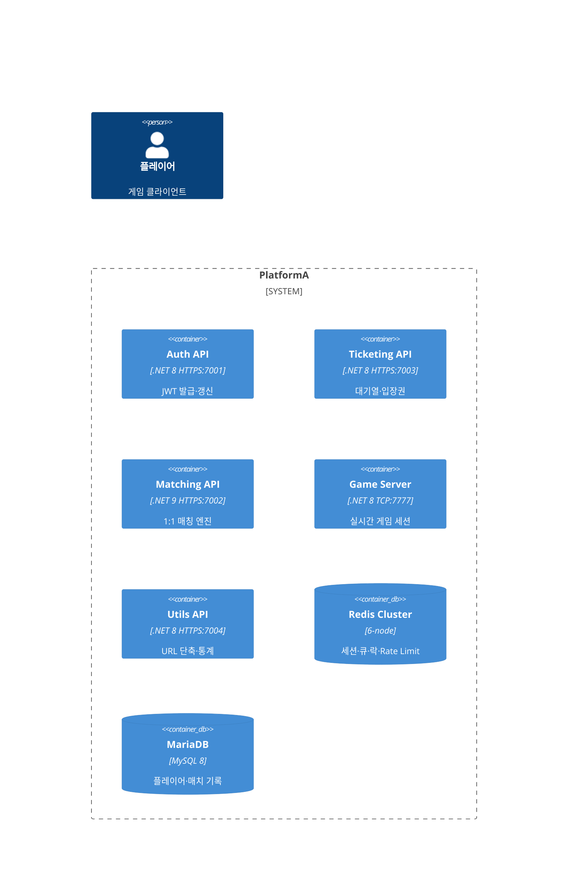
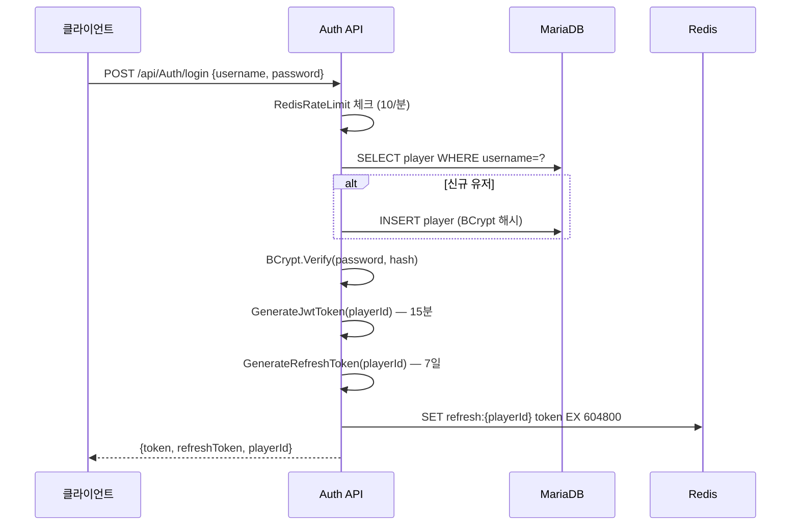
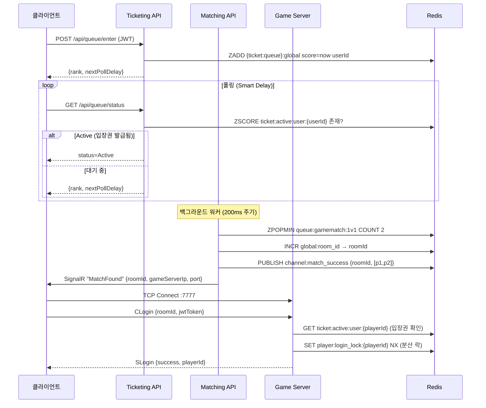
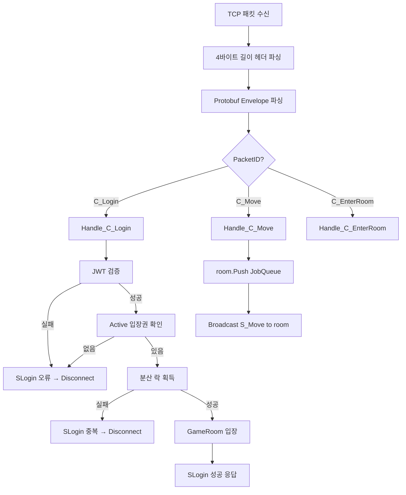
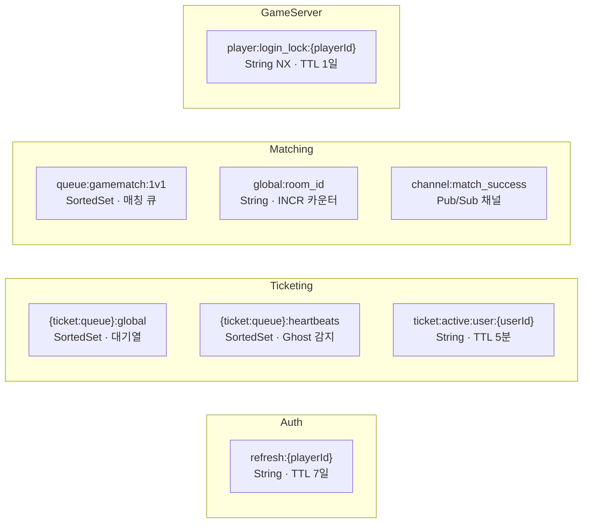
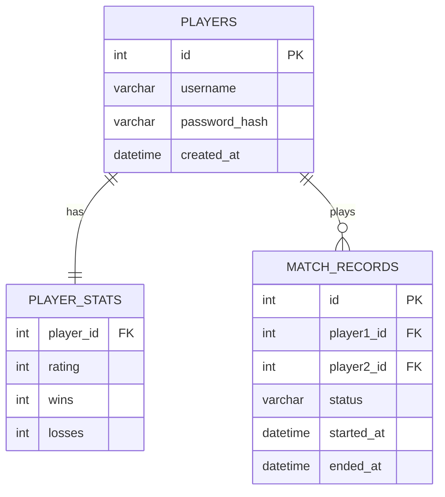

# Plan: PlatformA 문서화 체계 구축

## Context

외부 공개 및 신규 팀원 온보딩을 위한 문서화가 필요하다.  
현재 `AI/*.md` 형태의 내부 운영 문서는 잘 갖춰져 있으나, 외부 공개용 사이트·다이어그램·비개발자 가이드가 없다.  
개발자용 시각 자료(아키텍처·시퀀스·플로우차트), 비개발자용 가이드, 자동 API 레퍼런스(XML 주석 기반)를 갖춘 정적 문서 사이트를 GitHub Pages에 배포한다.

---

## 1. 툴링 결정: DocFX v2 + 개선 구성

### DocFX를 선택하는 이유

| 항목 | DocFX v2 (권장) | MkDocs Material (대안) |
|------|----------------|----------------------|
| XML 주석 → API 레퍼런스 자동 생성 | ✅ 네이티브 지원 | ❌ C# 미지원 |
| .NET 런타임만으로 실행 | ✅ | ❌ Python 필요 |
| GitHub Pages 자동 배포 | ✅ 공식 지원 | ✅ |
| Mermaid 다이어그램 | ⚠️ 플러그인 구성 필요 | ✅ 기본 내장 |
| 기본 테마 UX | ❌ 구식 | ✅ 매우 뛰어남 |
| 국내 회사 .NET 프로젝트 사례 | ✅ 다수 | ⚠️ 적음 |

**선택**: DocFX v2 + `docfx-material` 서드파티 테마 + Mermaid.js 수동 구성  
→ XML 자동 생성을 살리면서 테마 문제를 해결한다.

**참고 우수 사례:**
- [Hangfire](https://docs.hangfire.io) — DocFX 기반 .NET 잡 스케줄러 문서
- [Nakama (Heroic Labs)](https://heroiclabs.com/docs/) — MkDocs Material 기반 게임 서버 문서 (레이아웃 참고)
- [SignalR 공식 문서](https://learn.microsoft.com/aspnet/signalr) — Microsoft 스타일 기술 다이어그램
- [NServiceBus 문서](https://docs.particular.net) — 분산 메시징 서버, 시퀀스 다이어그램 구성 우수

> **미래 전환 권고:** Swagger UI(`Swashbuckle`)를 각 API에 이미 추가한다면, 추후  
> MkDocs Material + Swagger UI 임베드 방식으로 전환이 쉽다. 현 시점에선 DocFX가 최적.

---

## 2. 생성할 디렉토리 구조

```
docs/                                  ← 프로젝트 루트 아래 신규 생성
├── docfx.json                         # DocFX 설정 (빌드, 메타데이터, 테마)
├── toc.yml                            # 최상위 네비게이션
├── index.md                           # 홈 (프로젝트 한 줄 소개 + 퀵 링크)
│
├── architecture/                      # [개발자] 시각 설계 문서
│   ├── toc.yml
│   ├── overview.md                    # C4 컨테이너 다이어그램, 서비스 구조
│   ├── sequences.md                   # 4개 시퀀스 다이어그램
│   ├── redis-keyspace.md              # Redis 키 맵 & 역할
│   └── database-schema.md            # ER 다이어그램
│
├── developer-guide/                   # [개발자] 개발 가이드
│   ├── toc.yml
│   ├── getting-started.md             # 로컬 환경 세팅 (RUNBOOK.md 재구성)
│   ├── coding-patterns.md             # PATTERNS.md 시각화 버전
│   ├── packet-protocol.md             # TCP 패킷 프로토콜 상세
│   ├── redis-patterns.md              # Redis Lua 스크립트 & 분산 락
│   └── testing.md                     # 테스트 전략 & DummyClient
│
├── api-guide/                         # [개발자] REST API 가이드 (수동 Markdown)
│   ├── toc.yml
│   ├── auth.md                        # Auth API 엔드포인트
│   ├── ticketing.md
│   ├── matching.md
│   ├── utils.md
│   └── game-server-protocol.md        # TCP 패킷 명세
│
├── operations/                        # [운영팀] 배포 & 운영
│   ├── toc.yml
│   ├── deployment.md                  # Docker Compose + K8s (k8s/ 매니페스트 참조)
│   ├── monitoring.md                  # 헬스체크, 로그, 주요 지표
│   └── troubleshooting.md
│
├── stakeholder/                       # [비개발자] 이해관계자 가이드
│   ├── toc.yml
│   ├── overview.md                    # "PlatformA란?" 비기술적 설명
│   ├── user-journey.md                # 게임 플로우 스토리
│   └── faq.md
│
├── api/                               # DocFX 자동 생성 API 레퍼런스 (XML 주석)
│   └── (docfx metadata 명령으로 자동 생성)
│
└── .github/
    └── workflows/
        └── docs.yml                   # GitHub Pages 자동 배포
```

---

## 3. 다이어그램 명세 (Mermaid)

### 3-1. 아키텍처 개요 — `architecture/overview.md`

**C4 Container 다이어그램**


**서비스 책임 구분 표 (텍스트 보완)**

### 3-2. 로그인/인증 시퀀스 — `architecture/sequences.md`



### 3-3. 대기열 → 매칭 → 접속 시퀀스



### 3-4. Game Server 패킷 처리 플로우차트



### 3-5. Redis 키스페이스 맵 — `architecture/redis-keyspace.md`



### 3-6. DB ER 다이어그램 — `architecture/database-schema.md`



---

## 4. 비개발자 가이드 명세 — `stakeholder/`

### overview.md — "PlatformA란?"

**비유 설명 구조:**
1. **시스템 전체** → "놀이공원 운영 시스템" 비유
   - Auth API = 입구 신분 확인소
   - Ticketing API = 어트랙션 대기 번호표 발권기
   - Matching API = 짝 맞춰주는 안내원
   - Game Server = 실제 어트랙션 공간
2. **핵심 수치** 표: 최대 동시 대기 10,000명, 매칭 주기 200ms, 입장권 유효 5분
3. **보안 특징** (비기술적): "1회용 입장권", "자동 만료", "중복 입장 방지"

### user-journey.md — 게임 플레이어 여정

스토리 형식 (플로우차트 동반):
```
1. 로그인 (이메일/비번) → 자동 신규 등록
2. 대기열 진입 → 순위 확인 (스마트 폴링)
3. 입장권 발급 → 매칭 신청
4. 매칭 상대 찾음 → 게임 서버 접속 정보 수신
5. TCP 소켓 접속 → 게임 시작
```

### faq.md

예시 질문:
- "최대 몇 명까지 동시 접속할 수 있나요?"
- "매칭에 얼마나 걸리나요?"
- "접속이 끊기면 어떻게 되나요?"
- "데이터는 어디에 저장되나요?"

---

## 5. API 레퍼런스 자동 생성 설정

XML 주석 활성화 대상 프로젝트 (`*.csproj` 수정):
```xml
<PropertyGroup>
  <GenerateDocumentationFile>true</GenerateDocumentationFile>
  <DocumentationFile>bin\$(Configuration)\$(TargetFramework)\$(AssemblyName).xml</DocumentationFile>
</PropertyGroup>
```

대상 프로젝트:
- `PlatformA.Auth.API` — AuthController, Services
- `PlatformA.Ticketing.API` — 컨트롤러, QueueService
- `PlatformA.Matching.API` — GameMatchService, MatchingHub
- `PlatformA.Utils.API` — UtilController
- `PlatformA.Library` — Consts, TokenManager, RedisManager

`docfx.json` metadata 섹션:
```json
{
  "metadata": [
    {
      "src": [{"src": "../PlatformA", "files": ["**/*.csproj"]}],
      "dest": "api",
      "includePrivateMembers": false,
      "disableGitFeatures": false
    }
  ]
}
```

---

## 6. GitHub Actions 배포 워크플로우

파일: `.github/workflows/docs.yml`

```yaml
name: Docs → GitHub Pages
on:
  push:
    branches: [main]
    paths: ["docs/**", "PlatformA/**/*.cs"]

jobs:
  deploy:
    runs-on: ubuntu-latest
    permissions:
      contents: write
    steps:
    - uses: actions/checkout@v4
    - uses: actions/setup-dotnet@v4
      with: { dotnet-version: "8.0" }
    - run: dotnet tool install -g docfx
    - run: docfx docs/docfx.json
    - uses: peaceiris/actions-gh-pages@v4
      with:
        github_token: ${{ secrets.GITHUB_TOKEN }}
        publish_dir: docs/_site
```

---

## 7. 구현 순서 (단계별)

### Phase 1 — 기반 설정 + 핵심 다이어그램 (이번 PR)
1. `docs/docfx.json` 설정 파일 작성 (docfx-material 테마, Mermaid.js 구성)
2. `docs/toc.yml` + `docs/index.md` 홈 페이지
3. `architecture/overview.md` — C4 다이어그램 + 서비스 구조표
4. `architecture/sequences.md` — 4개 시퀀스 다이어그램 (위 3-2~3-4)
5. `architecture/redis-keyspace.md` — Redis 키 맵
6. `architecture/database-schema.md` — ER 다이어그램
7. `.github/workflows/docs.yml` — GitHub Actions 배포
8. 각 `.csproj`에 `GenerateDocumentationFile` 추가

### Phase 2 — 개발자 가이드
9. `developer-guide/getting-started.md` — 로컬 환경 세팅
10. `developer-guide/coding-patterns.md` — PATTERNS.md 시각화
11. `developer-guide/packet-protocol.md` — TCP 패킷 명세
12. `api-guide/` 4개 서비스 API 문서

### Phase 3 — 비개발자 가이드 + 운영
13. `stakeholder/overview.md` — 비유 설명 + 핵심 수치
14. `stakeholder/user-journey.md` — 스토리형 플레이어 여정
15. `stakeholder/faq.md`
16. `operations/deployment.md` (K8s 매니페스트 참조 포함)

---

## 수정 대상 기존 파일

| 파일 | 변경 내용 |
|------|---------|
| `PlatformA.Auth.API/PlatformA.Auth.API.csproj` | `GenerateDocumentationFile` 추가 |
| `PlatformA.Ticketing.API/*.csproj` | 동일 |
| `PlatformA.Matching.API/*.csproj` | 동일 |
| `PlatformA.Utils.API/*.csproj` | 동일 |
| `PlatformA.Library/*.csproj` | 동일 |

## 신규 생성 파일 (Phase 1 기준 — 9개 + .csproj 5개)

| 경로 | 용도 |
|------|------|
| `docs/docfx.json` | DocFX 빌드 설정 |
| `docs/toc.yml` | 최상위 네비게이션 |
| `docs/index.md` | 홈 |
| `docs/architecture/overview.md` | C4 + 서비스 구조 |
| `docs/architecture/sequences.md` | 시퀀스 다이어그램 4개 |
| `docs/architecture/redis-keyspace.md` | Redis 키 맵 |
| `docs/architecture/database-schema.md` | ER 다이어그램 |
| `.github/workflows/docs.yml` | 자동 배포 |
| `docs/architecture/toc.yml` | 섹션 네비게이션 |
