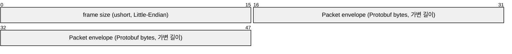
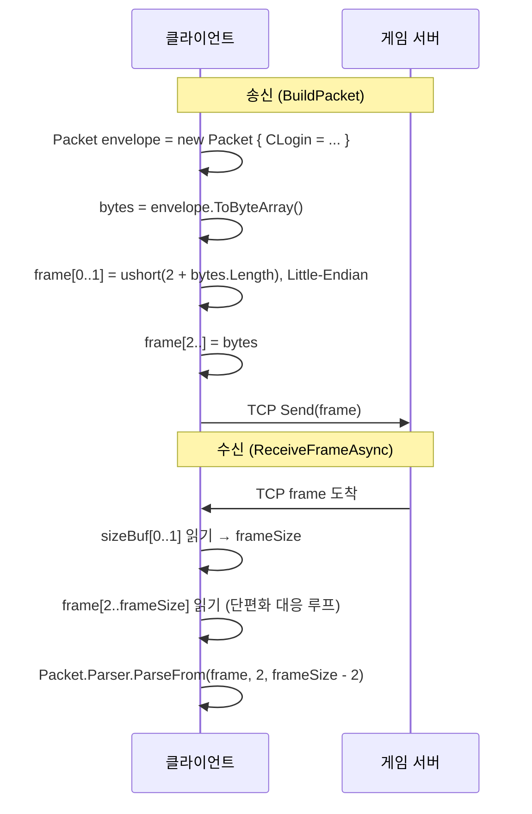
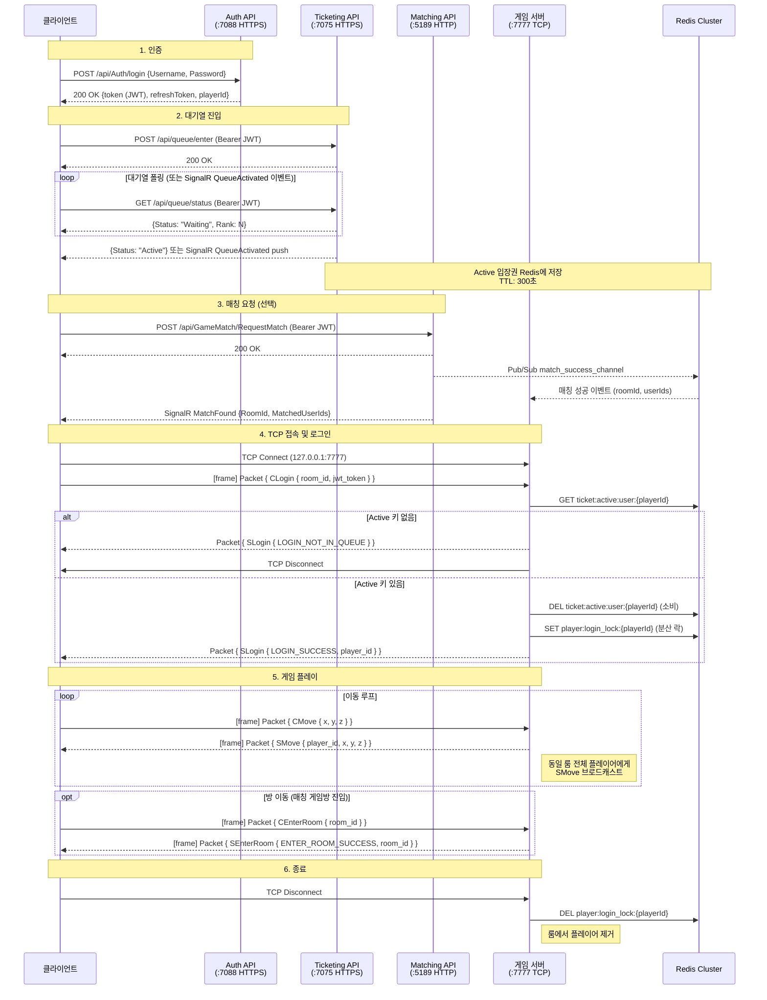
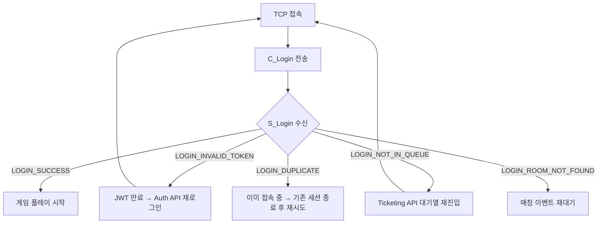
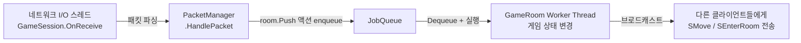

# 게임 서버 프로토콜 (TCP)

> **대상 독자**: 클라이언트 개발자, 서버 통합 담당자  
> **서버 버전**: PlatformA Game Server (.NET 8.0)  
> **최종 수정**: 2026-05-14

---

## 1. 접속 정보

| 항목 | 값 | 비고 |
|------|-----|------|
| 프로토콜 | TCP | Raw Socket (System.IO.Pipelines 기반) |
| 기본 호스트 | `127.0.0.1` | 환경변수 `GAME_SERVER_IP`로 오버라이드 |
| 기본 포트 | `7777` | 환경변수 `GAME_SERVER_PORT`로 오버라이드 |
| 직렬화 | Protocol Buffers (proto3) | JSON 사용 불가 (ADR-002) |

> **사전 조건**: 게임 서버 TCP 접속 전에 Ticketing API에서 발급한 입장권(Active 상태)이 유효해야 합니다.  
> Active TTL은 300초이며, 이 시간 내에 TCP 접속 및 `C_Login` 전송을 완료해야 합니다.

---

## 2. 바이너리 프레이밍

모든 TCP 메시지는 고정 크기 헤더 + 가변 길이 Protobuf 페이로드 구조를 사용합니다.

```
┌─────────────────────────────────────────────────────────────┐
│                     TCP 프레임 레이아웃                       │
├─────────────────┬───────────────────────────────────────────┤
│  헤더 (2 바이트) │           페이로드 (가변 길이)              │
│  [frame size]   │        [Packet envelope bytes]            │
│  ushort LE      │        (Google.Protobuf 직렬화)            │
└─────────────────┴───────────────────────────────────────────┘
```



### 헤더 규칙

- **크기**: 2바이트 (unsigned short, Little-Endian)
- **값**: 헤더 자신(2바이트) + 페이로드 길이의 합
  - 예: 페이로드가 10바이트이면 `frame size = 12`
- 최소 프레임 크기: 2 (페이로드 없음)
- 수신 측은 `frame size`만큼 정확히 읽어야 TCP 단편화 문제를 방지할 수 있습니다

### 송수신 흐름 다이어그램



---

## 3. Protobuf Envelope 구조

모든 패킷은 `Packet` 메시지로 감싸서 전송합니다. `oneof payload` 필드의 태그 번호가 PacketID 역할을 대신합니다.

```proto
// Packet — 모든 메시지를 감싸는 envelope
message Packet {
    oneof payload {
        CMove      c_move       = 1;
        SMove      s_move       = 2;
        CLogin     c_login      = 3;
        SLogin     s_login      = 4;
        CEnterRoom c_enter_room = 5;
        SEnterRoom s_enter_room = 6;
    }
}
```

수신 후 `envelope.PayloadCase`로 패킷 종류를 판별합니다.

---

## 4. 패킷 목록

### 4.1 열거형 (Enums)

#### LoginResultCode

| 값 | 이름 | 설명 |
|----|------|------|
| `0` | `LOGIN_SUCCESS` | 로그인 성공 (proto3 기본값 — 주의: wire에 포함되지 않음) |
| `1` | `LOGIN_INVALID_TOKEN` | JWT 토큰이 유효하지 않음 |
| `2` | `LOGIN_NOT_IN_QUEUE` | 대기열(Active 상태)을 통과하지 않은 접속 |
| `3` | `LOGIN_DUPLICATE` | 동일 플레이어가 이미 접속 중 (분산 락) |
| `4` | `LOGIN_ROOM_NOT_FOUND` | 입장 대상 방이 존재하지 않음 |

#### EnterRoomResultCode

| 값 | 이름 | 설명 |
|----|------|------|
| `0` | `ENTER_ROOM_SUCCESS` | 방 이동 성공 |
| `1` | `ENTER_ROOM_NOT_FOUND` | 대상 방 없음 |

> **proto3 주의사항**: 값이 `0`인 열거형 필드는 wire에 포함되지 않습니다. `LOGIN_SUCCESS = 0`, `ENTER_ROOM_SUCCESS = 0` 수신 시 필드 부재와 구분할 수 없으므로, `oneof`의 `PayloadCase`로 패킷 종류를 먼저 확인한 뒤 결과 코드를 해석하십시오.

### 4.2 패킷 명세

| oneof 태그 | 패킷 이름 | 방향 | 설명 |
|-----------|----------|------|------|
| `1` | `CMove` | C → S | 플레이어 이동 요청 |
| `2` | `SMove` | S → C | 이동 브로드캐스트 (룸 내 전체 플레이어에게 전송) |
| `3` | `CLogin` | C → S | 게임 서버 로그인 요청 |
| `4` | `SLogin` | S → C | 로그인 결과 응답 |
| `5` | `CEnterRoom` | C → S | 방 이동 요청 |
| `6` | `SEnterRoom` | S → C | 방 이동 결과 응답 |

---

### C_Login (태그 3) — C → S

TCP 접속 후 가장 먼저 전송해야 하는 패킷입니다.

```proto
message CLogin {
    int32  room_id   = 1;  // 입장할 방 ID (로비: 1)
    string jwt_token = 2;  // Auth API에서 발급한 JWT Access Token
}
```

| 필드 | 타입 | 설명 |
|------|------|------|
| `room_id` | int32 | 입장할 방 번호. 로비/광장은 `1` |
| `jwt_token` | string | Auth API `/api/Auth/login`에서 발급받은 Access Token (Bearer 접두사 불필요) |

---

### S_Login (태그 4) — S → C

`C_Login` 수신 후 서버가 즉시 응답하는 패킷입니다.

```proto
message SLogin {
    LoginResultCode result_code = 1;
    int32           player_id   = 2;
}
```

| 필드 | 타입 | 설명 |
|------|------|------|
| `result_code` | LoginResultCode | 로그인 결과 코드 |
| `player_id` | int32 | 성공 시 서버가 할당한 플레이어 ID; 실패 시 `0` |

로그인 실패 시 서버는 응답 직후 연결을 종료합니다.

---

### C_Move (태그 1) — C → S

플레이어의 이동 좌표를 서버로 전송합니다.

```proto
message CMove {
    float x = 1;
    float y = 2;
    float z = 3;
}
```

| 필드 | 타입 | 설명 |
|------|------|------|
| `x` | float | 목표 X 좌표 |
| `y` | float | 목표 Y 좌표 |
| `z` | float | 목표 Z 좌표 (2D 게임이면 `0.0` 고정) |

---

### S_Move (태그 2) — S → C

한 플레이어의 이동 정보를 같은 룸의 모든 플레이어에게 브로드캐스트합니다.

```proto
message SMove {
    int32 player_id = 1;
    float x         = 2;
    float y         = 3;
    float z         = 4;
}
```

| 필드 | 타입 | 설명 |
|------|------|------|
| `player_id` | int32 | 이동한 플레이어의 ID |
| `x` | float | 이동 후 X 좌표 |
| `y` | float | 이동 후 Y 좌표 |
| `z` | float | 이동 후 Z 좌표 |

---

### C_EnterRoom (태그 5) — C → S

현재 방에서 다른 방으로 이동을 요청합니다. 매칭 성사 후 게임 방 번호를 받았을 때 사용합니다.

```proto
message CEnterRoom {
    int32 room_id = 1;  // 이동할 방 ID
}
```

---

### S_EnterRoom (태그 6) — S → C

`C_EnterRoom` 요청에 대한 서버 응답입니다.

```proto
message SEnterRoom {
    EnterRoomResultCode result_code = 1;
    int32               room_id     = 2;
}
```

| 필드 | 타입 | 설명 |
|------|------|------|
| `result_code` | EnterRoomResultCode | 방 이동 결과 |
| `room_id` | int32 | 성공 시 이동한 방 ID |

---

## 5. 세션 흐름

### 5.1 전체 흐름 (접속 → 로그인 → 게임 → 종료)



### 5.2 로그인 결과별 처리



---

## 6. DummyClient 연동 예시

실제 `PlatformA.Game.DummyClient` 코드에서 발췌한 연결/패킷 전송 예시입니다.

### 6.1 TCP 연결 및 C_Login 전송

```csharp
using System.Net.Sockets;
using PlatformA.Library.Common;
using PlatformA.Library.Packets;

// TCP 소켓 생성 및 연결
using Socket client = new Socket(
    AddressFamily.InterNetwork, SocketType.Stream, ProtocolType.Tcp);

await client.ConnectAsync(Consts.GAME_SERVER_IP, Consts.GAME_SERVER_PORT);

// C_Login 패킷 빌드 및 전송
byte[] loginPacket = PacketHelper.BuildPacket(new Packet
{
    CLogin = new CLogin
    {
        RoomId   = 1,           // 로비(광장) 방 번호
        JwtToken = accessToken  // Auth API에서 발급받은 JWT Access Token
    }
});

await client.SendAsync(loginPacket, SocketFlags.None);
```

### 6.2 패킷 빌드 구현 (PacketHelper.BuildPacket)

```csharp
// 송신: Packet envelope → [ushort size (2B)][Packet bytes]
internal static byte[] BuildPacket(Packet envelope)
{
    byte[] envelopeBytes = envelope.ToByteArray();
    ushort size = (ushort)(2 + envelopeBytes.Length);
    byte[] buf = new byte[size];
    BinaryPrimitives.WriteUInt16LittleEndian(buf.AsSpan(0, 2), size);
    envelopeBytes.CopyTo(buf, 2);
    return buf;
}
```

### 6.3 프레임 수신 구현 (PacketHelper.ReceiveFrameAsync)

```csharp
// 수신: size 헤더를 실제로 사용해 정확한 바이트 수를 읽음 (TCP 단편화 대응)
internal static async Task<byte[]?> ReceiveFrameAsync(Socket socket, CancellationToken ct = default)
{
    byte[] sizeBuf = new byte[2];
    int totalRead = 0;
    while (totalRead < 2)
    {
        int n = await socket.ReceiveAsync(sizeBuf.AsMemory(totalRead), SocketFlags.None, ct);
        if (n == 0) return null; // 연결 종료
        totalRead += n;
    }

    ushort frameSize = BinaryPrimitives.ReadUInt16LittleEndian(sizeBuf);
    if (frameSize < 2) return null;

    byte[] frame = new byte[frameSize];
    sizeBuf.CopyTo(frame, 0);
    totalRead = 2;
    while (totalRead < frameSize)
    {
        int n = await socket.ReceiveAsync(frame.AsMemory(totalRead), SocketFlags.None, ct);
        if (n == 0) return null;
        totalRead += n;
    }
    return frame;
}
```

### 6.4 수신 루프에서 패킷 분기 처리

```csharp
while (true)
{
    byte[]? frame = await PacketHelper.ReceiveFrameAsync(client);
    if (frame == null) break; // 서버 연결 종료

    // frame[2..] 을 Packet envelope 으로 파싱
    Packet envelope = Packet.Parser.ParseFrom(frame, 2, frame.Length - 2);

    switch (envelope.PayloadCase)
    {
        case Packet.PayloadOneofCase.SLogin:
            SLogin login = envelope.SLogin;
            if (login.ResultCode == LoginResultCode.LoginSuccess)
                Console.WriteLine($"로그인 성공! PlayerID: {login.PlayerId}");
            else
                Console.WriteLine($"로그인 실패: {login.ResultCode}");
            break;

        case Packet.PayloadOneofCase.SMove:
            SMove move = envelope.SMove;
            Console.WriteLine($"플레이어 {move.PlayerId} 이동 → ({move.X}, {move.Y}, {move.Z})");
            break;

        case Packet.PayloadOneofCase.SEnterRoom:
            SEnterRoom enter = envelope.SEnterRoom;
            if (enter.ResultCode == EnterRoomResultCode.EnterRoomSuccess)
                Console.WriteLine($"{enter.RoomId}번 방에 입장 성공!");
            break;
    }
}
```

### 6.5 C_Move 전송 예시

```csharp
byte[] movePacket = PacketHelper.BuildPacket(new Packet
{
    CMove = new CMove { X = 10.5f, Y = -3.2f, Z = 0f }
});
await client.SendAsync(movePacket, SocketFlags.None);
```

### 6.6 C_EnterRoom 전송 예시 (매칭 성사 후)

```csharp
// 매칭 API가 SignalR MatchFound 이벤트로 RoomId를 전달한 경우
matchHub.On<MatchSuccessEvent>("MatchFound", async (matchInfo) =>
{
    byte[] enterPacket = PacketHelper.BuildPacket(new Packet
    {
        CEnterRoom = new CEnterRoom { RoomId = matchInfo.RoomId }
    });
    await client.SendAsync(enterPacket, SocketFlags.None);
});
```

---

## 7. 패킷 처리 아키텍처 (서버 내부)

클라이언트 개발자가 참고할 수 있는 서버 내부 스레드 모델입니다.



- 모든 게임 상태 변경은 반드시 `room.Push(action)`을 통해 직렬화됩니다
- 네트워크 스레드에서 직접 게임 상태를 수정하면 레이스 컨디션이 발생합니다

---

## 8. 환경변수 참조

`Consts.cs`에서 관리하는 게임 서버 관련 환경변수 목록입니다.

| 환경변수 | 기본값 | 설명 |
|---------|--------|------|
| `GAME_SERVER_IP` | `127.0.0.1` | 게임 서버 IP (K8s/Docker ConfigMap으로 오버라이드) |
| `GAME_SERVER_PORT` | `7777` | 게임 서버 포트 |
| `JWT_SECRET` | (하드코딩 기본값) | JWT 서명 키 — 프로덕션에서는 반드시 환경변수로 주입 |

---

## 관련 문서

- [Auth API](auth.md) — JWT Access Token 발급
- [Ticketing API](ticketing.md) — 대기열 진입 및 Active 입장권 발급
- [Matching API](matching.md) — 매칭 요청 및 게임방 배정
- `PlatformA/PlatformA.Library/Packets/Proto/packets.proto` — 패킷 정의 원본
- `PlatformA/PlatformA.Game.DummyClient/Scenarios/PacketHelper.cs` — 프레이밍 구현
- `AI/DOMAIN.md` — Game Server 세션 흐름 상세 규칙
