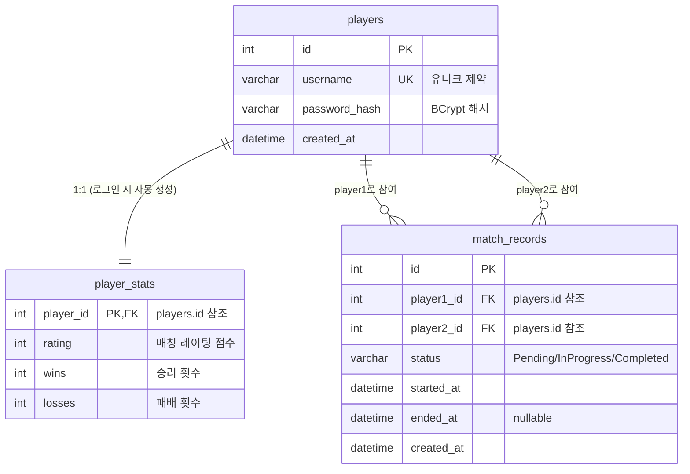

# 데이터베이스 스키마

PlatformA는 두 개의 MariaDB 데이터베이스를 사용합니다.

| 데이터베이스 | EF Core Context | 용도 |
|------------|-----------------|------|
| `db_WebApp` | `DbWebAppContext` | 플레이어 정보, 매치 기록 |
| `db_LogApp` | `DbLogAppContext` | 게임 플레이 로그 |

---

## ER 다이어그램 (db_WebApp)



---

## 테이블 명세

> **이 섹션은 `.github/scripts/generate_db_schema.py`로 자동 갱신됩니다.**

### item

> 테이블: item 플레이어 보유 아이템 정보.

| 컬럼 | 타입 | 제약 | 설명 |
|------|------|------|------|
| `pid` | BIGINT | NOT NULL | pid BIGINT PK |
| `tid` | BIGINT | NOT NULL | tid BIGINT (아이템 템플릿 ID) |
| `name` | VARCHAR(255) | NOT NULL |  |
| `uid` | BIGINT | NOT NULL | uid BIGINT (소유자 User.Pid) |
| `grade` | INT | NOT NULL | grade INT |

---

### match_records

> match_records.status 컬럼 값

| 컬럼 | 타입 | 제약 | 설명 |
|------|------|------|------|
| `id` | BIGINT | PK, NOT NULL | id BIGINT AUTO_INCREMENT PK |
| `player1_id` | INT | NOT NULL | player1_id INT NOT NULL (FK → players.id) |
| `player2_id` | INT | NOT NULL | player2_id INT NOT NULL (FK → players.id) |
| `winner_id` | INT | — | winner_id INT NULL (FK → players.id) |
| `status` | MATCHSTATUS | NOT NULL | status TINYINT NOT NULL DEFAULT 0 |
| `started_at` | DATETIME(6) | — | started_at DATETIME(6) NULL |
| `ended_at` | DATETIME(6) | — | ended_at DATETIME(6) NULL |
| `created_at` | DATETIME(6) | — | created_at DATETIME(6) DEFAULT CURRENT_TIMESTAMP |
| `player1` | PLAYER | NOT NULL |  |
| `player2` | PLAYER | NOT NULL |  |
| `winner` | PLAYER | — |  |

---

### players

> 테이블: players 플랫폼 계정 정보. Auth.API 로그인/회원가입에서 사용합니다.

| 컬럼 | 타입 | 제약 | 설명 |
|------|------|------|------|
| `id` | INT | PK, NOT NULL | id INT AUTO_INCREMENT PK |
| `username` | VARCHAR(255) | NOT NULL |  |
| `password_hash` | VARCHAR(255) | NOT NULL |  |
| `created_at` | DATETIME(6) | — | created_at DATETIME(6) DEFAULT CURRENT_TIMESTAMP |
| `1` | PLAYERSTAT | — | 1:N → match_records (player1 / player2) |

---

### player_stats

> 테이블: player_stats 플레이어 누적 전적. players 와 1:1 관계입니다.

| 컬럼 | 타입 | 제약 | 설명 |
|------|------|------|------|
| `id` | INT | PK, NOT NULL | id INT AUTO_INCREMENT PK |
| `player_id` | INT | NOT NULL | player_id INT UNIQUE NOT NULL (FK → players.id) |
| `total_games` | INT | NOT NULL | total_games INT DEFAULT 0 |
| `wins` | INT | NOT NULL | wins INT DEFAULT 0 |
| `losses` | INT | NOT NULL | losses INT DEFAULT 0 |
| `updated_at` | DATETIME(6) | — | updated_at DATETIME(6) ON UPDATE CURRENT_TIMESTAMP |
| `player` | PLAYER | NOT NULL |  |

---

### shop

> 테이블: shop 상점 상품 정보.

| 컬럼 | 타입 | 제약 | 설명 |
|------|------|------|------|
| `pid` | BIGINT | NOT NULL | pid BIGINT PK |
| `tid` | BIGINT | NOT NULL | tid BIGINT (상품 템플릿 ID) |
| `name` | VARCHAR(255) | NOT NULL |  |
| `uid` | BIGINT | NOT NULL | uid BIGINT (소유자 User.Pid) |

---

### user

> 테이블: user 게임 내 유저 정보.

| 컬럼 | 타입 | 제약 | 설명 |
|------|------|------|------|
| `pid` | BIGINT | NOT NULL | pid BIGINT PK |
| `uid` | BIGINT | NOT NULL | uid BIGINT (플랫폼 Player.Id 참조) |
| `name` | VARCHAR(255) | NOT NULL |  |
| `level` | INT | NOT NULL | level INT |

---

### access_logs

> 유저의 인증 관련 행동 기록 (login / logout / refresh)

| 컬럼 | 타입 | 제약 | 설명 |
|------|------|------|------|
| `id` | BIGINT | PK, NOT NULL |  |
| `player_id` | INT | NOT NULL | / <summary>"login" | "logout" | "refresh"</summary> |
| `action` | VARCHAR(255) | NOT NULL |  |
| `ip_address` | VARCHAR(255) | — |  |
| `created_at` | DATETIME(6) | — |  |

---
## Migration 관리

```bash
# db_WebApp Migration 생성
cd PlatformA/PlatformA.MySqlDB.Lib
dotnet ef migrations add AddRatingColumn --context DbWebAppContext --output-dir Migrations/WebApp

# db_LogApp Migration 생성
dotnet ef migrations add CreateGameLog --context DbLogAppContext --output-dir Migrations/LogApp

# 적용
dotnet ef database update --context DbWebAppContext
dotnet ef database update --context DbLogAppContext
```

> **규칙**: `ALTER TABLE` 직접 실행 금지. 반드시 EF Core Migration을 통해 변경.
