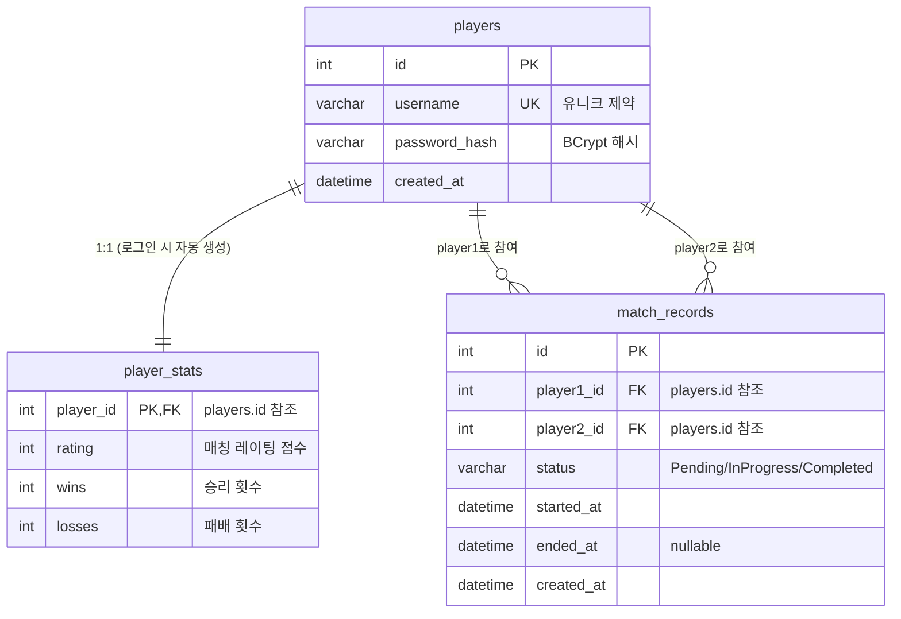
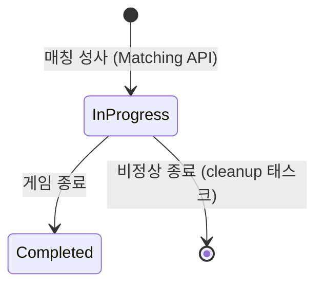

# 데이터베이스 스키마

PlatformA는 두 개의 MariaDB 데이터베이스를 사용합니다.

| 데이터베이스 | EF Core Context | 용도 |
|------------|-----------------|------|
| `db_WebApp` | `DbWebAppContext` | 플레이어 정보, 매치 기록 |
| `db_LogApp` | `DbLogAppContext` | 게임 플레이 로그 |

---

## ER 다이어그램 (db_WebApp)



---

## 테이블 명세

### players (네이밍: `snake_case`)

| 컬럼 | 타입 | 제약 | 설명 |
|------|------|------|------|
| `id` | INT | PK, AUTO_INCREMENT | 플레이어 고유 ID |
| `username` | VARCHAR(50) | NOT NULL, UNIQUE | 로그인 식별자 |
| `password_hash` | VARCHAR(255) | NOT NULL | BCrypt 해시 |
| `created_at` | DATETIME | NOT NULL | 계정 생성 시각 |

**특이사항**: 신규 유저는 로그인 시도 시 자동 등록됩니다. (Auth API에서 처리)

---

### player_stats

| 컬럼 | 타입 | 제약 | 설명 |
|------|------|------|------|
| `player_id` | INT | PK, FK → players.id | 플레이어 ID |
| `rating` | INT | NOT NULL, DEFAULT 1000 | ELO 레이팅 점수 |
| `wins` | INT | NOT NULL, DEFAULT 0 | 승리 횟수 |
| `losses` | INT | NOT NULL, DEFAULT 0 | 패배 횟수 |

---

### match_records

| 컬럼 | 타입 | 제약 | 설명 |
|------|------|------|------|
| `id` | INT | PK, AUTO_INCREMENT | 매치 고유 ID |
| `player1_id` | INT | FK → players.id | 매칭 플레이어 1 |
| `player2_id` | INT | FK → players.id | 매칭 플레이어 2 |
| `status` | VARCHAR(20) | NOT NULL | `Pending` / `InProgress` / `Completed` |
| `started_at` | DATETIME | NOT NULL | 매칭 성사 시각 |
| `ended_at` | DATETIME | NULL | 게임 종료 시각 |
| `created_at` | DATETIME | NOT NULL | 레코드 생성 시각 |

**상태 전이:**


---

## Migration 관리

```bash
# db_WebApp Migration 생성
cd PlatformA/PlatformA.MySqlDB.Lib
dotnet ef migrations add AddRatingColumn --context DbWebAppContext --output-dir Migrations/WebApp

# db_LogApp Migration 생성
dotnet ef migrations add CreateGameLog --context DbLogAppContext --output-dir Migrations/LogApp

# 적용
dotnet ef database update --context DbWebAppContext
dotnet ef database update --context DbLogAppContext
```

> **규칙**: `ALTER TABLE` 직접 실행 금지. 반드시 EF Core Migration을 통해 변경.
