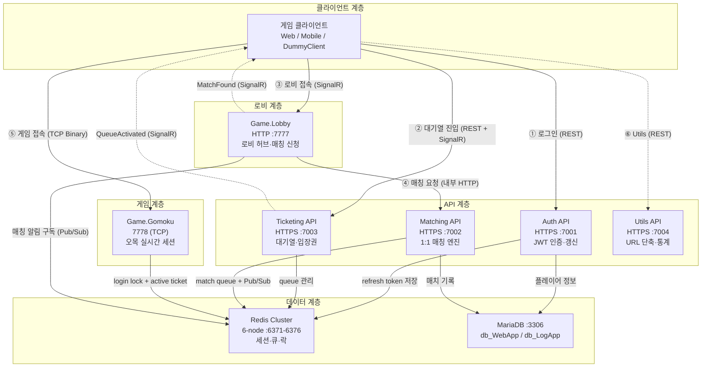

# 시스템 아키텍처 개요

> 이 파일은 `.github/scripts/generate_architecture_docs.py`가 자동 생성합니다.  
> **동적 섹션**(구성도·서비스표·통신방식·포트맵)은 직접 수정하지 마세요.  
> **정적 섹션**(핵심 설계 원칙·서비스 경계·프로젝트 의존성·런타임 버전)은
> `<!-- STATIC_BEGIN -->` / `<!-- STATIC_END -->` 블록 내에서 직접 편집할 수 있습니다.

## 전체 구성도



---

## 서비스별 책임

| 서비스 | 포트 | 주요 책임 | Redis 사용 | DB 사용 |
|--------|------|---------|-----------|--------|
| **Auth API** | HTTPS :7001 | JWT 발급·갱신·로그아웃, Rate Limit | `refresh:{playerId}` | `players`, `player_stats` |
| **Ticketing API** | HTTPS :7003 | 대기열 진입·이탈·순위 조회, 입장권 발급, Ghost 감지(Heartbeat) | `{ticket:queue}:global`, `ticket:active:user:{userId}` | — |
| **Matching API** | HTTPS :7002 | 매칭 큐 관리, ELO 기반 1:1 매칭, 타임아웃 처리, 매칭 알림 | `queue:gamematch:*`, `global:room_id`, Pub/Sub | `match_records` |
| **Game.Lobby** | HTTP :7777 | 로비 SignalR 허브, 매칭 신청·취소·상태 조회 (Matching 내부 HTTP 경유), 유저 프레젠스 | Pub/Sub 구독 (MatchNotificationService) | — |
| **Game.Gomoku** | 7778 (TCP) | Binary Protobuf 패킷 처리, 분산 락으로 중복 로그인 방지, 오목 GameRoom 브로드캐스트 | `player:login_lock:{playerId}` | — |
| **Utils API** | HTTPS :7004 | URL 단축(Snowflake+Base62), IP 지오로케이션, 클릭 통계 | Rate Limit | SQLite (`app.db`) |

---

## 통신 방식

| 통신 | 방식 | 용도 |
|------|------|------|
| 클라이언트 ↔ Auth / Ticketing / Matching / Utils | REST over HTTPS | 일반 API 호출 |
| 클라이언트 ↔ Ticketing | SignalR WebSocket | `QueueActivated` 이벤트 수신 |
| 클라이언트 ↔ Game.Lobby | SignalR WebSocket | `MatchFound`, `MatchTimeout`, 프레젠스 이벤트 |
| 클라이언트 ↔ Game.Gomoku | TCP Raw Socket | Binary Protobuf 패킷 |
| Game.Lobby → Matching.API | 내부 HTTP (IHttpClientFactory) | 매칭 요청·취소·상태 조회 |
| Matching.API → Game.Lobby | Redis Pub/Sub | 매칭 성사 이벤트 (`MATCH_FOUND_CHANNEL`) |

---

## 포트 맵

| 서비스 | 프로토콜 | 포트 |
|--------|---------|------|
| Auth API | HTTPS | 7001 |
| Matching API | HTTPS | 7002 |
| Ticketing API | HTTPS | 7003 |
| Utils API | HTTP/HTTPS | 7004 |
| Game.Lobby | HTTP + SignalR | 7777 |
| Game.Gomoku | TCP | 7778 |
| Game.Gomoku HealthCheck | HTTP | 7779 |
| Redis 마스터 1~3 | TCP | 6371~6373 |
| Redis 레플리카 1~3 | TCP | 6374~6376 |
| MySQL | TCP | 3306 |

---

<!-- STATIC_BEGIN -->
## 핵심 설계 원칙

1. **Redis Cluster 필수** — 단일 Redis 인스턴스 사용 금지 (ADR-001)
2. **Binary 패킷 프로토콜** — Game Server 통신은 Protobuf Envelope (ADR-007)
3. **설정 중앙화** — 모든 상수는 `Consts.cs`에서 환경변수로 관리 (ADR-003, ADR-004)
4. **무상태 JWT 인증** — Game.Gomoku는 MySQL 직접 접근 안 함
5. **IDbContextFactory** — EF Core DbContext는 Factory 방식으로만 DI (`DbContext` 직접 주입 금지)
6. **Lua 스크립트 원자성** — Redis 멀티키 연산은 Lua 스크립트로 Race Condition 방지
7. **JobQueue 단일 스레드** — GomokuRoom의 모든 작업은 순차 처리 (lock 불필요)
8. **서비스 내부 통신** — 클라이언트는 Matching.API에 직접 연결 불가, Game.Lobby 경유 필수

---

## 서비스 경계 규칙

각 서비스는 자신의 책임 범위 외 작업을 수행하면 안 된다.

| 서비스 | 금지 사항 |
|--------|---------|
| **Auth API** | 게임 로직, 매칭 로직 처리 |
| **Ticketing API** | 매칭 결과 처리, 게임 룸 생성 |
| **Matching API** | 클라이언트 직접 SignalR 연결 수락 (Game.Lobby 경유 필수) |
| **Game.Lobby** | 게임 로직 처리, DB 직접 접근 |
| **Game.Gomoku** | HTTP API 호출, MySQL 직접 접근 |
| **Utils API** | 게임/인증/매칭 로직 |

---

## 프로젝트 의존성

```
PlatformA.Library
        │ (참조)
        ├── PlatformA.Auth.API
        ├── PlatformA.Matching.API
        ├── PlatformA.Ticketing.API
        ├── PlatformA.Utils.API
        ├── PlatformA.Game.Lobby
        └── PlatformA.Game.Gomoku

PlatformA.MySqlDB.Lib
        │ (참조)
        ├── PlatformA.Auth.API
        └── PlatformA.Matching.API
```

---

## 런타임 버전

<!-- RUNTIME_TABLE -->
| 서비스 | .NET 버전 | 비고 |
|--------|----------|------|
| Auth API | .NET 10.0 |  |
| Ticketing API | .NET 10.0 |  |
| Matching API | .NET 10.0 |  |
| Game.Lobby | .NET 10.0 |  |
| Game.Gomoku | .NET 10.0 | Console App (ASP.NET Core 아님) |
| Utils API | .NET 10.0 |  |
<!-- /RUNTIME_TABLE -->
<!-- STATIC_END -->
