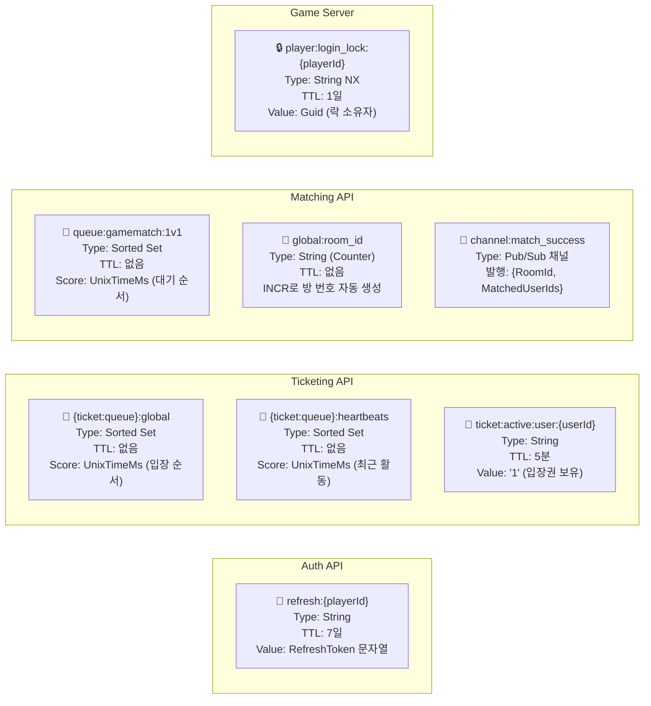

# Redis 키스페이스

## 키 상수 목록

> 아래 표는 `Consts.cs`에서 자동 추출됩니다. 키 추가·변경은 `Consts.cs`에서만 하세요.

<!-- REDIS_KEY_TABLE_START -->
| 상수명 | 키 패턴 | TTL | 서비스 | 설명 |
|---|---|---|---|---|
| `REFRESH_TOKEN_KEY_PREFIX` | `refresh:{id}` | 7일 (604,800초) | Auth API |  |
| `QUEUE_KEY` | `{ticket:queue}:global` | 없음 | Ticketing API | CRC16("{ticket:queue}") → 동일 슬롯 보장. |
| `QUEUE_HEARTBEATS_KEY` | `{ticket:queue}:heartbeats` | 없음 | Ticketing API | CRC16("{ticket:queue}") → 동일 슬롯 보장. |
| `ACTIVE_USER_KEY_PREFIX` | `ticket:active:user:{id}` | 5분 (300초) | Ticketing API | 사용법: $"{ACTIVE_USER_KEY_PREFIX}{userId}" |
| `MATCH_QUEUE_KEY` | `queue:gamematch:1v1` | 없음 | Matching API | Redis Sorted Set 기반 매칭 대기열 (score = 입장 시각 UnixMs, 타임아웃 추적 가능) |
| `REDIS_SHORT_URL_KEY` | `url:{0}` | 없음 | Utils API | Utils.API — Short URL ({0}: 단축 코드) |
| `REDIS_SHORT_URL_STATS_KEY` | `stats:{0}` | 없음 | Utils API | Utils.API — Short URL ({0}: 단축 코드) |
| `REDIS_DIRTY_CODES_KEY` | `dirty_codes` | 없음 | Utils API |  |
<!-- REDIS_KEY_TABLE_END -->

---

## 전체 키 맵



---

## 키 상세 명세

### Auth API

| 키 패턴 | `refresh:{playerId}` |
|--------|---------------------|
| **타입** | String |
| **TTL** | 604,800초 (7일) |
| **값** | `"{playerId}:{uuid}"` 형식의 RefreshToken 문자열 |
| **쓰기** | 로그인 성공 시, Token Rotation 시 |
| **읽기/삭제** | 토큰 갱신, 로그아웃 시 Lua 스크립트로 원자적 GET+DEL |
| **특징** | 단일 세션 강제 — 새 로그인 시 기존 토큰 덮어쓰기 |

---

### Ticketing API

| 키 패턴 | `{ticket:queue}:global` |
|--------|------------------------|
| **타입** | Sorted Set |
| **Score** | 입장 시각 (UnixTimeMilliseconds) |
| **Member** | userId (string) |
| **최대 크기** | 10,000개 (Lua로 원자적 제한) |
| **쓰기** | 대기열 진입 (`ZADD`) |
| **읽기** | 순위 조회 (`ZRANK`) |
| **삭제** | 이탈 (`ZREM`), 입장권 발급 후 제거 |

| 키 패턴 | `{ticket:queue}:heartbeats` |
|--------|----------------------------|
| **타입** | Sorted Set |
| **Score** | 최근 Heartbeat 시각 |
| **용도** | Ghost 유저 감지 — 5분 이상 활동 없으면 강제 제거 |
| **해시태그** | `{ticket:queue}` → `:global`과 동일 Cluster 슬롯 보장 → Lua 멀티키 가능 |

| 키 패턴 | `ticket:active:user:{userId}` |
|--------|-------------------------------|
| **타입** | String |
| **TTL** | 300초 (5분) — 미사용 시 자동 만료 |
| **값** | `"1"` |
| **의미** | 해당 유저가 입장권 보유 중 → Game Server 접속 허용 |
| **Game Server에서** | 존재 확인 후 `DEL`로 회수 (1회용 티켓) |

---

### Matching API

| 키 패턴 | `queue:gamematch:1v1` |
|--------|----------------------|
| **타입** | Sorted Set |
| **Score** | 매칭 요청 시각 |
| **처리** | 200ms마다 백그라운드 워커가 `ZPOPMIN COUNT 2` |
| **롤백** | 1명만 있을 경우 다시 `ZADD` (Lua 원자적 보장) |

| 키 패턴 | `global:room_id` |
|--------|-----------------|
| **타입** | String (숫자) |
| **연산** | `INCR` — 매 매칭 성사 시 1 증가 |
| **특이사항** | 결과가 `1`이면 로비 방 번호 → 스킵하고 재시도 |

---

### Game Server

| 키 패턴 | `player:login_lock:{playerId}` |
|--------|-------------------------------|
| **타입** | String |
| **TTL** | 86,400초 (1일) |
| **값** | Guid 문자열 (락 소유자 식별) |
| **획득** | `SET NX EX` (원자적) |
| **해제** | Lua: `GET` → `COMPARE` → `DEL` (내 락인 경우만 해제) |
| **중복 로그인** | 락 획득 실패 시 즉시 연결 거부 |

---

## Cluster 슬롯 설계

Redis Cluster에서 Lua 스크립트는 **동일 슬롯**의 키에만 접근 가능합니다.

```
{ticket:queue}:global    ─┐
{ticket:queue}:heartbeats ─┤ 해시태그 {ticket:queue}로 동일 슬롯 보장
```

> **주의**: `ticket:active:user:{userId}` 는 별개 슬롯이므로 대기열 키와 Lua에서 함께 사용 불가.
> 이 제약은 의도된 설계 — 입장권 발급은 별도 키로 분리 관리.
