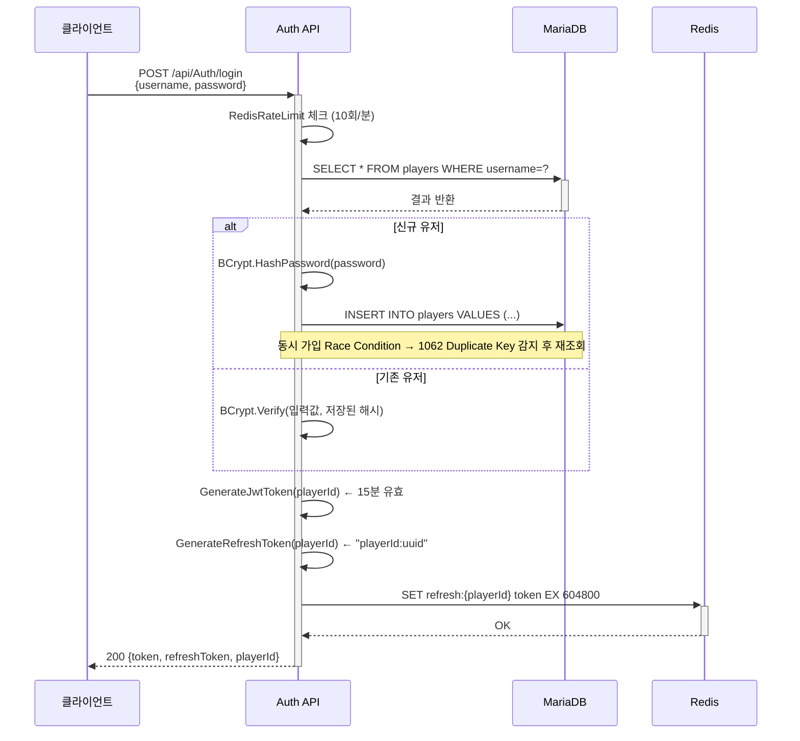
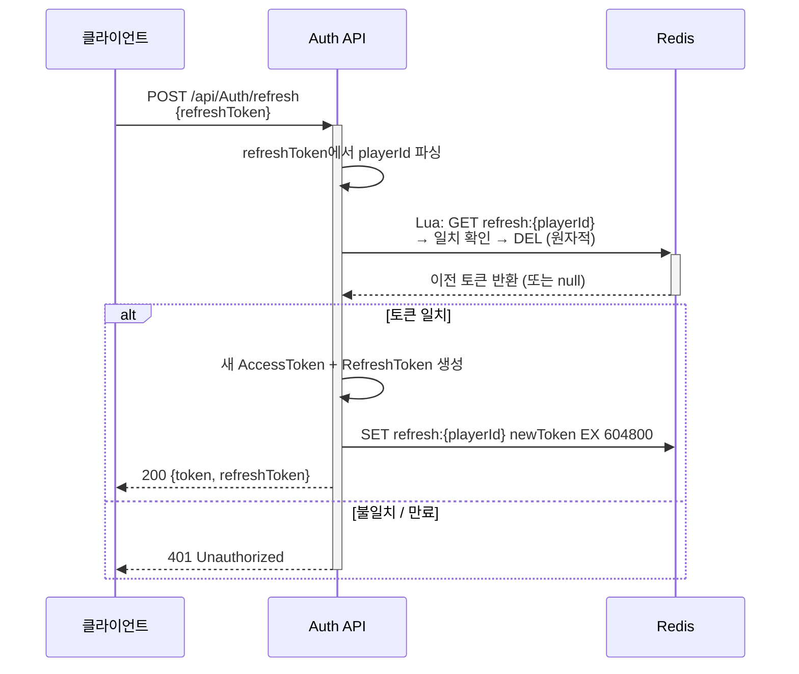
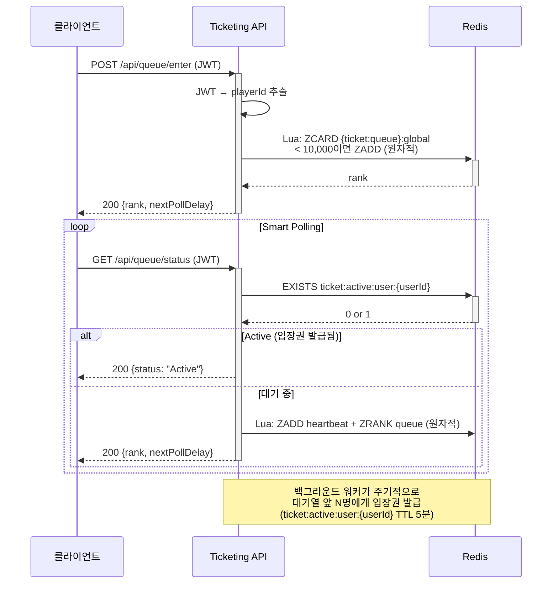
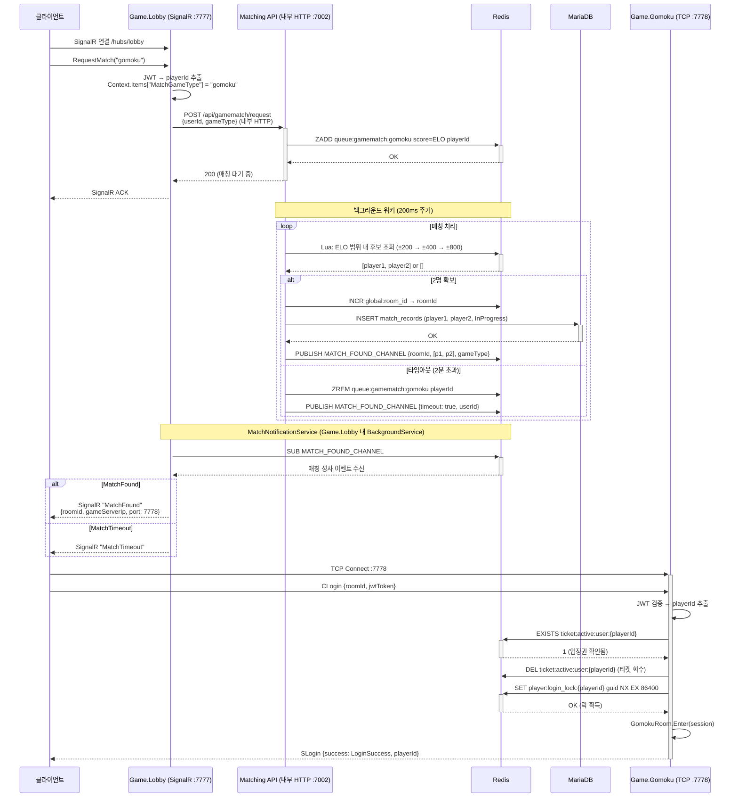
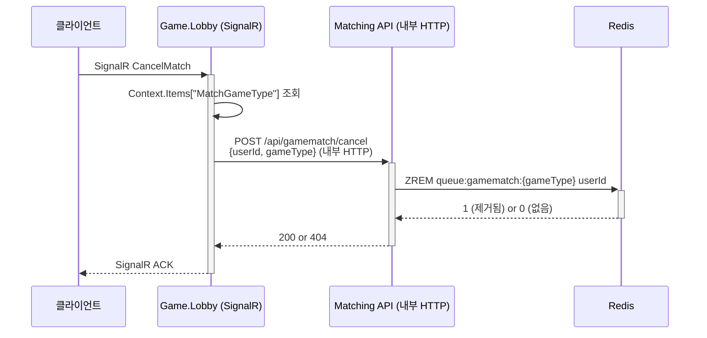
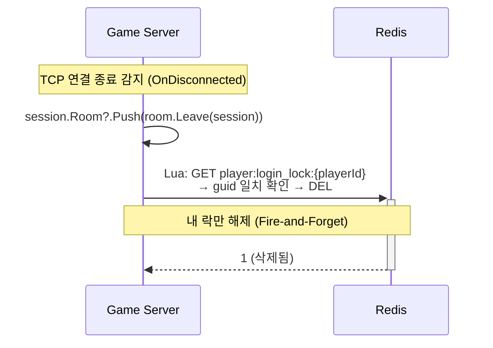

# 시퀀스 다이어그램

## 1. 로그인 / 인증 플로우



**Token Rotation (POST /api/Auth/refresh):**



---

## 2. 대기열 진입 → 입장권 발급



---

## 3. 매칭 요청 → Game.Gomoku 접속

> **현재 아키텍처**: 클라이언트는 Matching.API에 직접 접근하지 않습니다.
> 모든 매칭 흐름은 Game.Lobby SignalR 허브를 경유합니다.



**매칭 취소 (CancelMatch):**



---

## 4. Game Server 패킷 처리 플로우

```mermaid
flowchart TD
  A[TCP 패킷 수신] --> B["4바이트 크기 헤더 파싱\n(Little-Endian)"]
  B --> C["Protobuf Envelope 파싱\nPacket.Parser.ParseFrom(buffer)"]
  C --> D{PayloadOneofCase}

  D -->|CLogin| E[Handle_C_Login]
  D -->|CMove| F[Handle_C_Move]
  D -->|CEnterRoom| G[Handle_C_EnterRoom]
  D -->|미등록| H[로그 경고 후 무시]

  E --> E1[JWT 검증]
  E1 -->|실패| E2["SLogin(LoginInvalidToken)\n→ Disconnect"]
  E1 -->|성공| E3[Redis: Active 입장권 확인]
  E3 -->|없음| E4["SLogin(LoginNotInQueue)\n→ Disconnect"]
  E3 -->|있음| E5[Redis: SET NX 분산 락]
  E5 -->|락 실패 = 중복 로그인| E6["SLogin(LoginDuplicate)\n→ Disconnect"]
  E5 -->|락 성공| E7[GameRoom.Enter(session)]
  E7 --> E8["SLogin(LoginSuccess) 응답"]

  F --> F1["room.Push(JobQueue)"]
  F1 --> F2["room.Broadcast(SMove)\n→ 방의 모든 세션에 전송"]

  G --> G1[GameRoomManager.FindRoom]
  G1 -->|없음| G2["SEnterRoom(NotFound)"]
  G1 -->|있음| G3["currentRoom.Leave\n→ newRoom.Enter\n→ SEnterRoom(Success)"]

  style E2 fill:#ffcccc
  style E4 fill:#ffcccc
  style E6 fill:#ffcccc
  style G2 fill:#ffcccc
  style E8 fill:#ccffcc
  style F2 fill:#ccffcc
  style G3 fill:#ccffcc
```

---

## 5. 세션 종료 플로우


