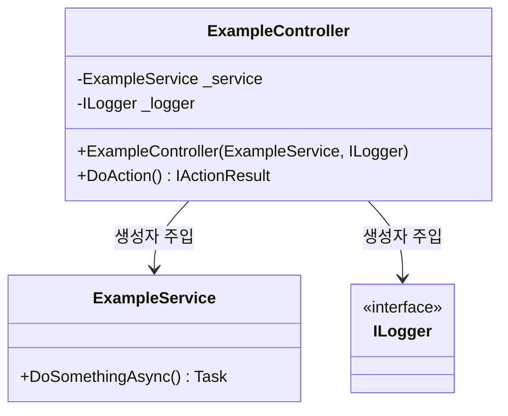
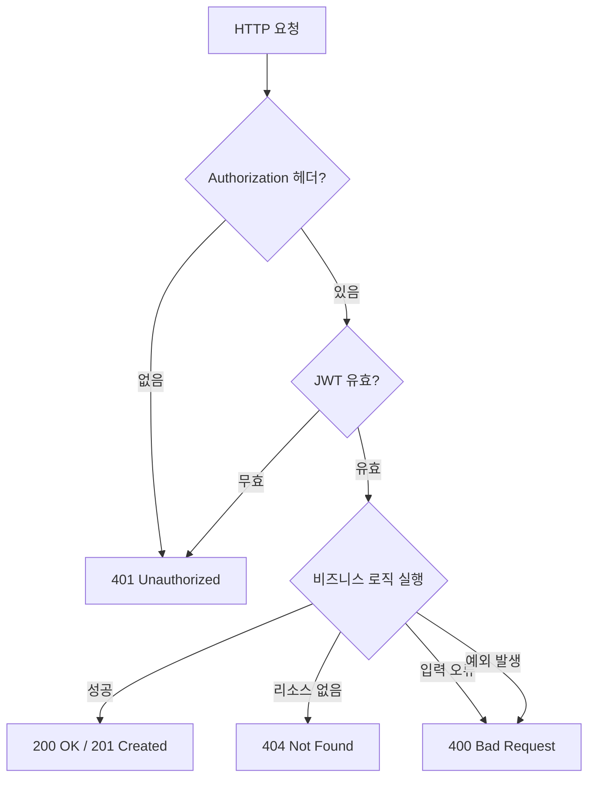
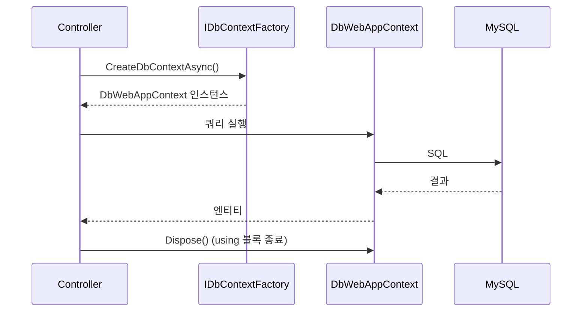

# 코딩 패턴 가이드

PlatformA에서 사용하는 공통 코딩 패턴을 정리한 문서입니다.
이 패턴에서 벗어나려면 사용자 승인이 필요합니다.

---

## 1. 의존성 주입 (DI) 패턴

모든 서비스는 생성자 주입(Constructor Injection)을 사용합니다. `new` 키워드로 직접 인스턴스를 생성하는 것은 금지됩니다.



### DI 수명 주기 선택 기준

| 수명 주기 | 등록 방법 | 사용 시점 |
|---|---|---|
| Singleton | `AddSingleton<T>()` | 앱 전체에서 공유되는 상태 (예: `RedisManager`) |
| Scoped | `AddScoped<T>()` | HTTP 요청 하나에 하나의 인스턴스 (예: 컨트롤러, DB 서비스) |
| Transient | `AddTransient<T>()` | 매번 새 인스턴스가 필요한 경량 서비스 |
| HostedService | `AddHostedService<T>()` | 앱 수명 동안 실행되는 백그라운드 워커 |

```csharp
// Program.cs 등록 예시
builder.Services.AddSingleton<ExampleSingletonService>();
builder.Services.AddScoped<ExampleScopedService>();
builder.Services.AddHostedService<ExampleWorkerService>();
```

---

## 2. API 컨트롤러 패턴

### 컨트롤러 구조

```csharp
[ApiController]
[Route("api/[controller]")]
public class ExampleController : ControllerBase
{
    private readonly ExampleService _service;
    private readonly ILogger<ExampleController> _logger;

    // 생성자 DI — new 키워드로 직접 생성 금지
    public ExampleController(ExampleService service, ILogger<ExampleController> logger)
    {
        _service = service;
        _logger = logger;
    }

    [RedisRateLimit("policyName")]   // Rate Limit 필요 시
    [HttpPost("action")]
    public async Task<IActionResult> DoAction([FromBody] RequestDto request)
    {
        string authHeader = Request.Headers["Authorization"].ToString();
        if (string.IsNullOrEmpty(authHeader) || !authHeader.StartsWith("Bearer"))
            return Unauthorized(new { Message = "토큰이 없습니다." });

        int userId = TokenManager.ValidateTokenAndGetUserId(authHeader.Substring(7));
        if (userId <= 0)
            return Unauthorized(new { Message = "유효하지 않은 토큰입니다." });

        try
        {
            var result = await _service.DoSomethingAsync(userId);
            if (result == null)
                return NotFound(new { Message = "리소스를 찾을 수 없습니다." });

            _logger.LogInformation("[Example] 성공. UserId: {UserId}", userId);
            return Ok(result);
        }
        catch (Exception ex)
        {
            _logger.LogError(ex, "[Example] 예외 발생. UserId: {UserId}", userId);
            return BadRequest(ex.Message);
        }
    }
}
```

### API 응답 형식 통일

모든 컨트롤러는 아래 응답 형식을 반드시 따릅니다. 다른 오류 객체 형식은 금지됩니다.

```csharp
// 200 OK (성공)
return Ok(new { FieldName = value });
return Ok(new ResponseDto { ... });

// 201 Created
return CreatedAtAction(nameof(Get), new { id = result.Id }, result);

// 400 Bad Request
return BadRequest(new { Message = "설명" });

// 401 Unauthorized
return Unauthorized(new { Message = "설명" });

// 404 Not Found
return NotFound(new { Message = "설명" });

// 429 Rate Limit (RedisRateLimitFilter에서 자동 처리)
return StatusCode(429, "Too many requests");
```



---

## 3. Request DTO 정의 패턴

DataAnnotation으로 입력 검증을 선언합니다.

```csharp
public class CreateSomethingRequest
{
    [Required(ErrorMessage = "필드는 필수입니다.")]
    [MinLength(3)]
    [MaxLength(100)]
    public string Name { get; set; } = string.Empty;

    [Range(1, 10000)]
    public int Count { get; set; }
}
```

참조 파일: `PlatformA.Auth.API/Models/Auth.cs`

---

## 4. EF Core IDbContextFactory 패턴

`DbContext` 직접 주입은 금지입니다. `IDbContextFactory<TContext>`를 사용해 요청마다 새 컨텍스트를 생성하세요.



### Entity 추가 절차

**Step 1: Entity 클래스 정의**

위치: `PlatformA.MySqlDB.Lib/DBWebApp/Entities/`

```csharp
public class NewEntity
{
    public int Id { get; set; }
    public string Name { get; set; } = string.Empty;
    public DateTime CreatedAt { get; set; }

    public int PlayerId { get; set; }
    public Player Player { get; set; } = null!;
}
```

**Step 2: DbContext에 DbSet 추가**

```csharp
public virtual DbSet<NewEntity> NewEntities { get; set; }
```

**Step 3: OnModelCreating 설정**

```csharp
modelBuilder.Entity<NewEntity>(entity =>
{
    entity.ToTable("new_entities");       // 테이블명 snake_case 필수
    entity.HasKey(e => e.Id);
    entity.Property(e => e.Name)
        .IsRequired()
        .HasMaxLength(100);
    entity.Property(e => e.CreatedAt)
        .HasDefaultValueSql("CURRENT_TIMESTAMP(6)");
    entity.HasIndex(e => e.PlayerId);
    entity.HasOne(e => e.Player)
        .WithMany()
        .HasForeignKey(e => e.PlayerId)
        .OnDelete(DeleteBehavior.Cascade);
});
```

**Step 4: Migration 생성 및 적용**

```bash
cd PlatformA/PlatformA.MySqlDB.Lib
dotnet ef migrations add Add_NewEntity \
  --context DbWebAppContext \
  --output-dir Migrations/WebApp
dotnet ef database update --context DbWebAppContext
```

### DbContext 구분

| Context | 용도 | Migration 경로 |
|---|---|---|
| `DbWebAppContext` | 플레이어/아이템/매칭 데이터 | `Migrations/WebApp` |
| `DbLogAppContext` | 접속 로그 | `Migrations/LogApp` |

---

## 5. 백그라운드 서비스 패턴

```csharp
public class ExampleWorkerService : BackgroundService
{
    private readonly ILogger<ExampleWorkerService> _logger;
    private readonly ExampleService _service;

    public ExampleWorkerService(ILogger<ExampleWorkerService> logger, ExampleService service)
    {
        _logger = logger;
        _service = service;
    }

    protected override async Task ExecuteAsync(CancellationToken stoppingToken)
    {
        while (!stoppingToken.IsCancellationRequested)
        {
            try
            {
                await _service.DoPeriodicWorkAsync();
            }
            catch (Exception ex)
            {
                _logger.LogError(ex, "[Worker] 주기 작업 실패");
            }

            await Task.Delay(TimeSpan.FromSeconds(5), stoppingToken);
        }
    }
}

// Program.cs에서 등록
builder.Services.AddHostedService<ExampleWorkerService>();
```

참조 파일: `PlatformA.Ticketing.API/Services/QueueWorkerService.cs`

---

## 6. Health Check 패턴

```csharp
// Program.cs
builder.Services.AddHealthChecks()
    .AddRedis(Consts.REDIS_CONNECTION_STRING, name: "redis", tags: ["readiness"])
    .AddCheck<CustomHealthCheck>("custom-check", tags: ["readiness"]);

// 커스텀 헬스체크
public class CustomHealthCheck : IHealthCheck
{
    public async Task<HealthCheckResult> CheckHealthAsync(
        HealthCheckContext context, CancellationToken ct)
    {
        try
        {
            // 검증 로직
            return HealthCheckResult.Healthy();
        }
        catch (Exception ex)
        {
            return HealthCheckResult.Unhealthy(ex.Message);
        }
    }
}
```

---

## 참조 문서

- `AI/PATTERNS.md` — 원본 패턴 가이드 (실제 코드베이스에서 추출됨)
- `.claude/rules/api-controllers.md` — API 컨트롤러 세부 규칙
- `.claude/rules/ef-migrations.md` — EF Core Migration 규칙
