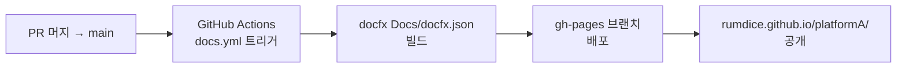

# 문서 기여 가이드

이 사이트는 [DocFX v2](https://dotnet.github.io/docfx/)로 빌드되며 GitHub Pages에 자동 배포된다.  
문서를 수정하거나 추가할 때는 **로컬에서 먼저 확인한 뒤 PR을 올린다.**

## 사전 준비 (최초 1회)

```powershell
# DocFX 설치
dotnet tool install -g docfx

# 로컬 HTTP 서버 설치
dotnet tool install -g dotnet-serve
```

## 로컬 테스트 절차

### 1단계 — 빌드

프로젝트 루트(`platformA/`)에서 실행한다.

```powershell
$env:PATH = "$env:PATH;$env:USERPROFILE\.dotnet\tools"
docfx Docs/docfx.json
```

빌드 결과는 `Docs/_site/` 디렉토리에 생성된다.

> **참고**: 빌드 시 NuGet 취약점 경고(NU1902/NU1903)와 Phase 2 문서 미완성 경고가 출력되나 무시해도 된다.  
> `Build succeeded with warning. 0 error(s)` 가 나오면 정상이다.

### 2단계 — 로컬 서버 실행

```powershell
& "$env:USERPROFILE\.dotnet\tools\dotnet-serve.exe" `
    --directory Docs/_site `
    --port 8080 `
    --open-browser
```

브라우저가 자동으로 열리며 `http://localhost:8080` 에서 확인할 수 있다.

> **주의**: DocFX 내장 `--serve` 옵션은 Windows에서 Content-Type 헤더에 charset을 포함하지 않아  
> 한국어가 깨질 수 있다. 반드시 `dotnet-serve`를 사용한다.

### 3단계 — 확인 체크리스트

| 항목 | 확인 방법 |
|------|---------|
| 한국어 정상 표시 | 홈(`/`) 제목과 본문이 깨지지 않는지 |
| Mermaid 다이어그램 렌더링 | `아키텍처 → 시스템 개요` 에서 SVG 다이어그램 표시 여부 |
| 네비게이션 동작 | 좌측 메뉴 클릭 시 페이지 이동 |
| 검색 동작 | 상단 검색창에서 키워드 입력 후 결과 표시 |

### 4단계 — PR 생성

로컬 확인 후 커밋하고 PR을 올린다.

```bash
git checkout -b YYYY-MM-DD_DocsUpdate
git add Docs/
git commit -m "docs: 변경 내용 요약"
git push -u origin YYYY-MM-DD_DocsUpdate
```

## 자동 배포 구조



`main` 브랜치에 `Docs/**` 또는 `PlatformA/**/*.cs` 변경이 push되면 자동으로 빌드·배포된다.

## 디렉토리 구조

```
Docs/
├── docfx.json                  # DocFX 빌드 설정
├── toc.yml                     # 최상위 네비게이션
├── index.md                    # 홈 페이지
├── architecture/               # 아키텍처 다이어그램
├── developer-guide/            # 개발자 가이드 (현재 파일)
├── stakeholder/                # 비개발자 가이드
└── templates/custom/           # DocFX 커스텀 템플릿
    └── partials/
        └── head.tmpl.partial   # charset + Mermaid.js 주입
```

## 자주 발생하는 문제

### `_site`가 이전 내용을 보여줄 때

DocFX는 증분 빌드를 하므로 오래된 파일이 남아있을 수 있다. 클린 빌드를 수행한다.

```powershell
Remove-Item -Recurse -Force Docs/_site
docfx Docs/docfx.json
```

### Mermaid 다이어그램이 raw 텍스트로 보일 때

브라우저 캐시 문제일 가능성이 높다. `Ctrl+Shift+R` (강제 새로고침) 후 재확인한다.

### `dotnet-serve`를 찾을 수 없을 때

새 터미널을 열면 PATH가 초기화된다. 아래 명령으로 전체 경로를 직접 사용한다.

```powershell
& "$env:USERPROFILE\.dotnet\tools\dotnet-serve.exe" --directory Docs/_site --port 8080
```
