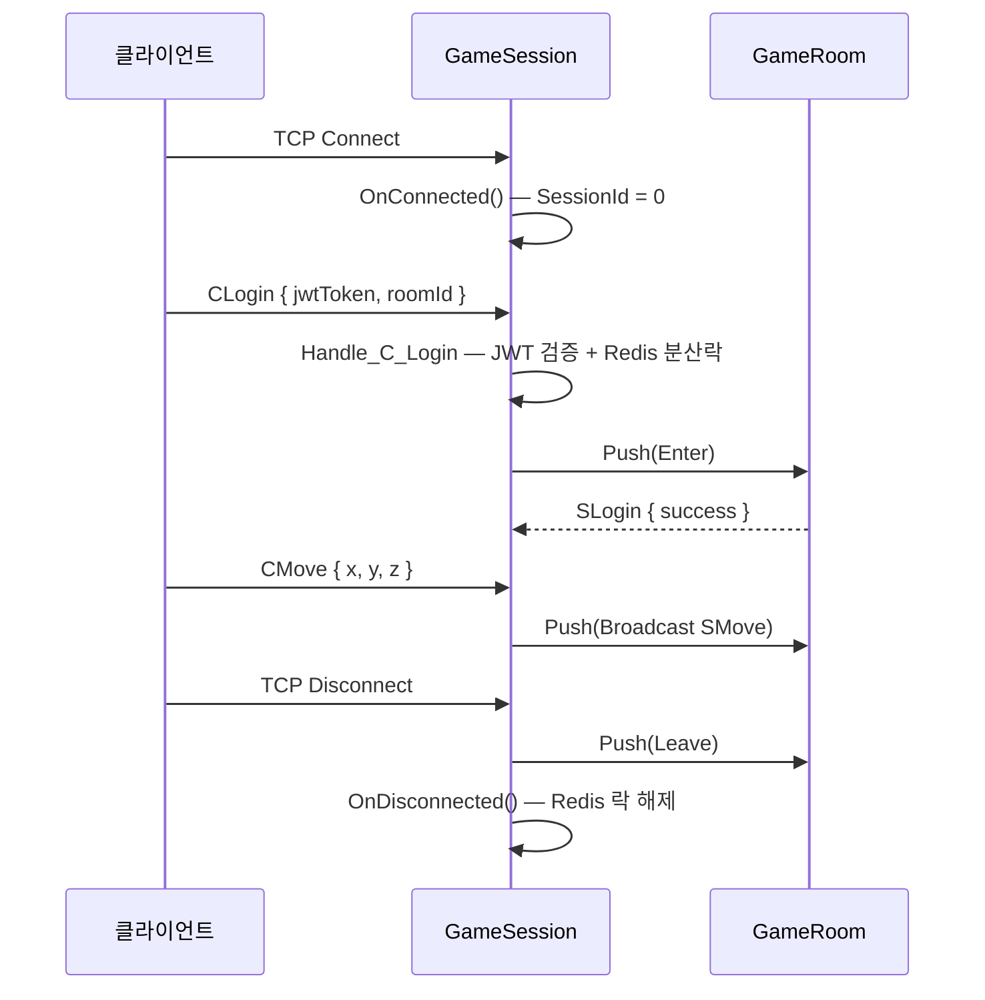

# Game.Server 아키텍처

PlatformA.Game.Server는 TCP 소켓 기반 실시간 게임 서버입니다.
REST API 없이 Protobuf 바이너리 패킷으로 클라이언트와 통신합니다.

| 항목 | 값 |
|------|---|
| 포트 | 7777 (TCP) |
| 런타임 | .NET 10.0 |
| 패킷 포맷 | `[size: 2B LE] [Protobuf envelope]` |
| 동시성 모델 | Lock-Free JobQueue |
| 인증 | JWT (CLogin 패킷으로 전달) |

---

## 전체 구조

```
클라이언트 (DummyClient)
    │
    │  TCP Socket
    ▼
┌───────────────────────────────────┐
│  Session (Library)                │
│  ┌────────────┐ ┌───────────────┐ │
│  │ FillPipe   │ │  ReadPipe     │ │  ← System.IO.Pipelines
│  │ (소켓 수신) │ │  (패킷 분리) │ │
│  └────────────┘ └──────┬────────┘ │
└─────────────────────────┼─────────┘
                          │ OnRecv(ReadOnlySequence<byte>)
                          ▼
               GameSession.OnRecv()
                          │ ParseFrom(Protobuf)
                          ▼
              PacketManager.HandlePacket()
                          │ [PacketHandler] 어트리뷰트로 디스패치
                          ▼
              PacketHandler.Handle_C_*()
                          │ room.Push(lambda)
                          ▼
                    GameRoom (JobQueue)
                          │
                    게임 상태 변경
                    room.Broadcast()
```

---

## Session 수명주기



---

## 패킷 프레임 구조

```
┌────────────────┬──────────────────────────────┐
│  size (2B LE)  │  Protobuf Envelope (N bytes)  │
└────────────────┴──────────────────────────────┘
```

- `size` : 헤더 포함 전체 패킷 길이 (uint16, Little-Endian)
- Envelope : `ProtoPacket` oneof 메시지 — 패킷 종류와 페이로드를 하나의 필드로 결합

**예시 (CLogin 패킷)**

```
[0x1E 0x00]  // size = 30
[Protobuf]   // ProtoPacket { CLogin { jwt_token: "..." } }
```

패킷 정의 위치: `PlatformA/PlatformA.Library/Packets/Proto/packets.proto`

---

## Lock-Free JobQueue 패턴

`GameRoom`의 상태(_sessions 목록, 점수 등)는 여러 스레드가 동시에 접근합니다.
PlatformA는 전통적인 `lock` 대신 **JobQueue**로 모든 상태 변경을 단일 스레드에서 순서대로 실행합니다.

```csharp
// ✅ 올바른 패턴 — room.Push()를 통해 직렬화
room.Push(() =>
{
    room.Enter(session);          // 단일 스레드에서 실행됨 → lock 불필요
    room.Broadcast(responsePacket);
});

// ❌ 금지 — Push 밖에서 게임 상태 직접 수정
session.Room.Enter(session);      // 레이스 컨디션 발생 가능
```

**JobQueue 동작 원리**

1. `Push(job)` 호출 시 내부 `Queue<Action>`에 job 추가
2. 현재 실행 중인 Flush가 없으면 현재 스레드가 `Flush()` 시작
3. `Flush()`는 Queue가 빌 때까지 순서대로 실행 후 종료

→ 여러 스레드가 Push해도 실행은 항상 한 번에 하나씩 보장

---

## Redis 분산락 — 중복 로그인 방지

동일 플레이어가 두 개의 TCP 연결로 동시에 로그인하는 경우를 차단합니다.

```csharp
// Handle_C_Login 내부
string lockKey = $"player:login_lock:{playerId}";
string? lockValue = await RedisManager.Instance.LockManager.AcquireLockAsync(
    lockKey,
    expiry: TimeSpan.FromSeconds(30),
    waitTime: TimeSpan.FromSeconds(5),
    retryTime: TimeSpan.FromMilliseconds(100));

if (lockValue == null)
{
    // 이미 다른 연결이 락을 점유 중 → 로그인 거부
    session.SendAsync(SLoginFail);
    return;
}

session.LoginLockValue = lockValue;  // 연결 종료 시 해제에 사용

// OnDisconnected()에서
await RedisManager.Instance.LockManager.ReleaseLockAsync(lockKey, lockValue);
```

---

## Matching.API → Game.Server 이벤트 흐름

매칭 성사 시 Matching.API가 Redis Pub/Sub으로 Game.Server에 알립니다.

```
Matching.API                Redis              Game.Server
     │                        │                     │
     │── PUBLISH match:{id} ─►│                     │
     │                        │── 이벤트 Push ──────►│
     │                        │                     │ CreateRoom(roomId)
     │                        │                     │ (클라이언트 접속 대기)
```

구독 채널: `Consts.REDIS_MATCH_RESULT_CHANNEL` (`PlatformA/PlatformA.Library/Common/Consts.cs` 참조)
