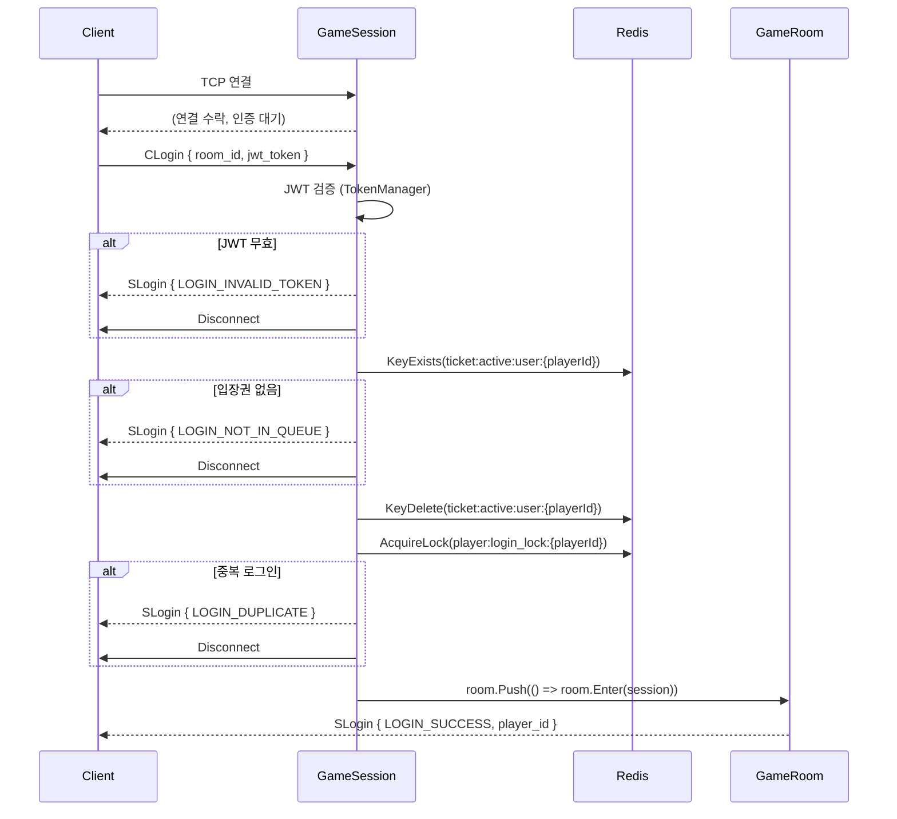
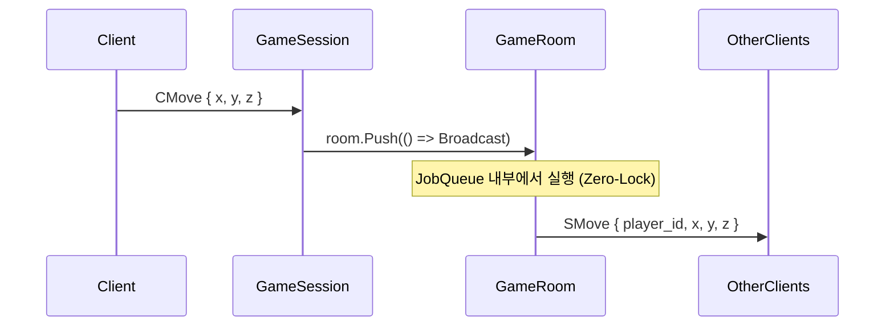
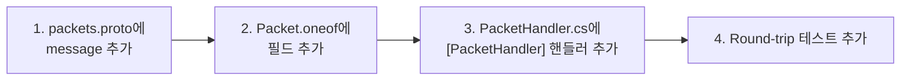

# TCP 패킷 프로토콜

PlatformA 게임 서버는 TCP 소켓 위에서 Protobuf 기반 바이너리 프레이밍 프로토콜을 사용합니다.
이 문서는 ADR-003(Protobuf 전환)과 ADR-005(Envelope 와이어 포맷)를 기반으로 작성됩니다.

---

## 와이어 포맷 (Wire Format)

모든 TCP 프레임은 2바이트 헤더와 Protobuf Envelope 페이로드로 구성됩니다.

```
┌─────────────────┬──────────────────────────────────────┐
│  size (2B LE)   │  Packet envelope (Protobuf, N bytes)  │
└─────────────────┴──────────────────────────────────────┘
```

- `size`: 프레임 전체 크기 (2 + envelope 바이트 수), **Little Endian ushort**
- `Packet envelope`: `Packet { oneof payload { ... } }` 메시지를 Protobuf 직렬화한 바이트

> ADR-005: 구형 4바이트 헤더(`ushort size | ushort packetId`)에서 2바이트 헤더로 변경되었습니다.
> `packetId`는 Protobuf `oneof` field tag(1~6)로 대체되어 컴파일 타임 타입 체크가 가능합니다.

---

## Protobuf Envelope 구조

모든 패킷은 `Packet` 메시지로 감싸져 전송됩니다. `oneof payload` 필드의 tag 번호가 패킷 종류를 식별합니다.

```proto
// PlatformA.Library/Packets/Proto/packets.proto

message Packet {
    oneof payload {
        CMove      c_move       = 1;
        SMove      s_move       = 2;
        CLogin     c_login      = 3;
        SLogin     s_login      = 4;
        CEnterRoom c_enter_room = 5;
        SEnterRoom s_enter_room = 6;
    }
}
```

`Packet.PayloadOneofCase` 열거형 값(1~6)이 패킷 식별자로 사용됩니다.

---

## 패킷 목록

### 클라이언트 → 서버 (CXxx)

| 패킷 | oneof tag | 필드 | 설명 |
|---|---|---|---|
| `CMove` | 1 | `float x, y, z` | 플레이어 이동 요청 |
| `CLogin` | 3 | `int32 room_id`, `string jwt_token` | JWT 인증 후 입장 요청 |
| `CEnterRoom` | 5 | `int32 room_id` | 다른 방으로 이동 요청 |

### 서버 → 클라이언트 (SXxx)

| 패킷 | oneof tag | 필드 | 설명 |
|---|---|---|---|
| `SMove` | 2 | `int32 player_id`, `float x, y, z` | 이동 브로드캐스트 |
| `SLogin` | 4 | `LoginResultCode result_code`, `int32 player_id` | 로그인 결과 |
| `SEnterRoom` | 6 | `EnterRoomResultCode result_code`, `int32 room_id` | 방 이동 결과 |

### 결과 코드 열거형

**LoginResultCode**

| 값 | 이름 | 설명 |
|---|---|---|
| 0 | `LOGIN_SUCCESS` | 로그인 성공 (proto3 기본값 — wire에 포함되지 않음) |
| 1 | `LOGIN_INVALID_TOKEN` | JWT 토큰 검증 실패 |
| 2 | `LOGIN_NOT_IN_QUEUE` | 대기열을 거치지 않은 불법 접속 |
| 3 | `LOGIN_DUPLICATE` | 중복 로그인 차단 |
| 4 | `LOGIN_ROOM_NOT_FOUND` | 입장할 방이 존재하지 않음 |

**EnterRoomResultCode**

| 값 | 이름 | 설명 |
|---|---|---|
| 0 | `ENTER_ROOM_SUCCESS` | 방 이동 성공 (proto3 기본값) |
| 1 | `ENTER_ROOM_NOT_FOUND` | 대상 방이 존재하지 않음 |

> **proto3 기본값 주의**: 값이 `0`인 enum 필드(예: `LOGIN_SUCCESS = 0`)는 wire에 포함되지 않습니다.
> 수신 측은 필드 부재를 기본값(0 = 성공)으로 복원하므로 의미상 동일하지만, 혼동에 주의하세요.

---

## 로그인 시퀀스



---

## 이동 브로드캐스트 시퀀스



---

## 패킷 직렬화 / 역직렬화

### 송신 (서버 → 클라이언트)

```csharp
// PacketHandler.cs의 BuildResponsePacket 헬퍼
private static byte[] BuildResponsePacket(ProtoPacket envelope)
{
    byte[] envelopeBytes = envelope.ToByteArray();
    ushort size = (ushort)(2 + envelopeBytes.Length);
    byte[] buf = new byte[size];
    BinaryPrimitives.WriteUInt16LittleEndian(buf.AsSpan(0, 2), size);
    envelopeBytes.CopyTo(buf, 2);
    return buf;
}

// 사용 예시
room.Broadcast(BuildResponsePacket(new ProtoPacket
{
    SMove = new SMove
    {
        PlayerId = session.SessionId,
        X = moveReq.X,
        Y = moveReq.Y,
        Z = moveReq.Z,
    },
}));
```

### 수신 (클라이언트 → 서버)

```csharp
// GameSession.OnRecv — 헤더 2바이트 건너뛰고 Envelope 파싱
protected override void OnRecv(ReadOnlySequence<byte> packet)
{
    ReadOnlySpan<byte> span = packet.IsSingleSegment
        ? packet.FirstSpan
        : packet.ToArray().AsSpan();

    // offset 2부터 Packet envelope 파싱
    ReadOnlySpan<byte> envelopeBytes = span.Slice(2);
    try
    {
        ProtoPacket envelope = ProtoPacket.Parser.ParseFrom(envelopeBytes);
        PacketManager<GameSession>.Instance.HandlePacket(this, envelope);
    }
    catch (InvalidProtocolBufferException ex)
    {
        Console.WriteLine($"[OnRecv] 잘못된 패킷: {ex.Message}");
        Disconnect();
    }
}
```

---

## 패킷 핸들러 등록

`[PacketHandler]` 어트리뷰트에 `Packet.PayloadOneofCase` 값을 지정합니다.

```csharp
// PacketHandler.cs
[PacketHandler(ProtoPacket.PayloadOneofCase.CMove)]
public static void Handle_C_Move(GameSession session, ProtoPacket packet)
{
    CMove moveReq = packet.CMove;

    GameRoom room = session.Room;
    if (room == null) return;

    room.Push(() =>
    {
        // GameRoom의 JobQueue 내부에서만 게임 상태를 수정합니다.
        room.Broadcast(BuildResponsePacket(new ProtoPacket
        {
            SMove = new SMove { PlayerId = session.SessionId, X = moveReq.X, ... },
        }));
    });
}
```

> **중요**: 게임 상태 수정은 반드시 `room.Push()` 내부에서만 수행합니다.
> `Push()` 밖에서 게임 상태를 수정하면 레이스 컨디션이 발생합니다.

---

## 새 패킷 추가 절차



1. `PlatformA.Library/Packets/Proto/packets.proto`에 `message` 정의 추가
2. `Packet { oneof payload { ... } }`에 새 필드 추가
3. `PlatformA.Game.Server/Packet/PacketHandler.cs`에 핸들러 추가
4. `PacketFramingTests.cs`에 round-trip 테스트 추가

---

## 네임스페이스 충돌 처리

`PlatformA.Game.Server.Packet` 네임스페이스가 `Packet` 클래스를 가립니다.
`GameSession.cs`와 `PacketHandler.cs`에서 아래 별칭을 사용합니다.

```csharp
using ProtoPacket = PlatformA.Library.Packets.Packet;
```

---

## 참조 문서

- `PlatformA.Library/Packets/Proto/packets.proto` — 패킷 IDL 정의
- `PlatformA.Game.Server/Network/GameSession.cs` — 수신 처리
- `PlatformA.Game.Server/Packet/PacketHandler.cs` — 핸들러 구현
- `AI/adr/003-protobuf-packet-migration.md` — Protobuf 전환 결정
- `AI/adr/005-protobuf-envelope-wire-format.md` — Envelope 와이어 포맷 결정
