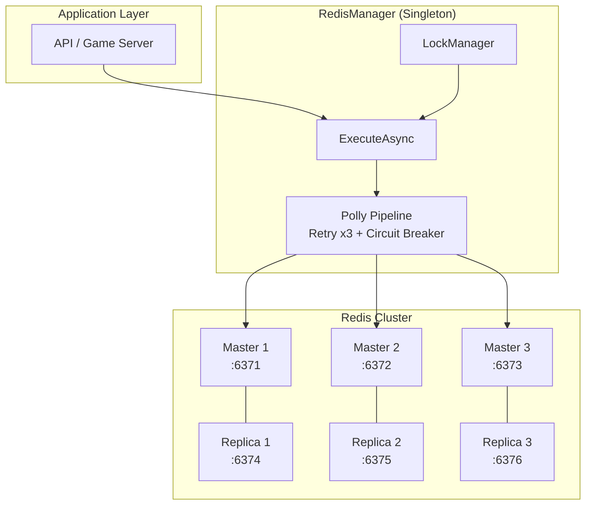
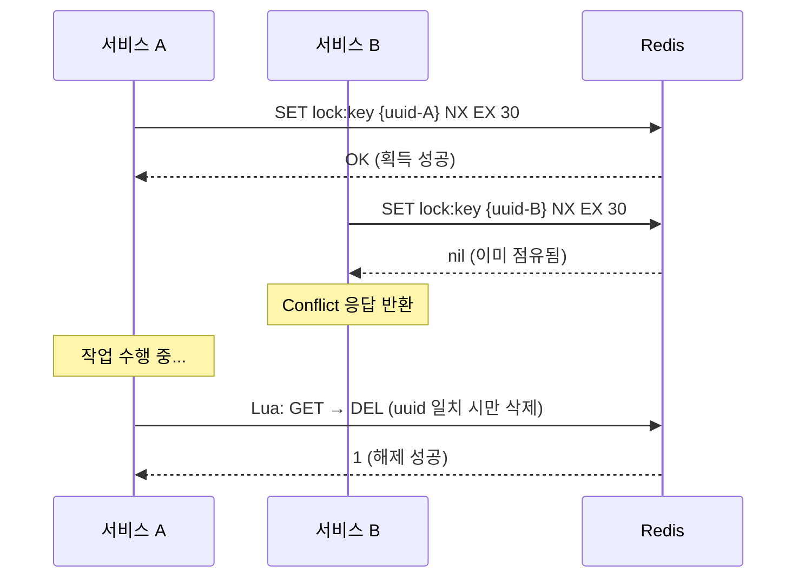
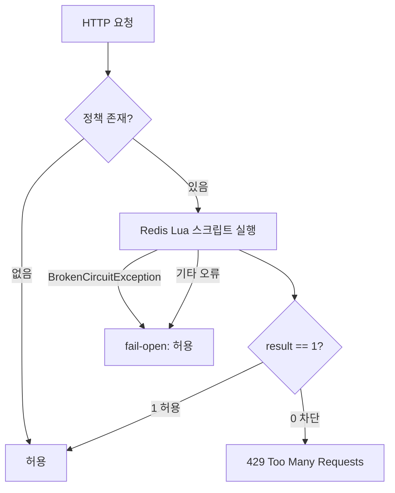

# Redis 패턴 가이드

PlatformA에서 Redis를 사용하는 패턴을 정리한 문서입니다.
Redis 관련 모든 접근은 `RedisManager.ExecuteAsync`를 통해 Polly 파이프라인이 적용됩니다.

---

## 아키텍처 개요

PlatformA는 **Redis Cluster (3 Master + 3 Replica)** 구성을 사용합니다 (ADR-001).



---

## Redis 키 네이밍 컨벤션

모든 Redis 키는 `PlatformA.Library/Common/Consts.cs`에 상수로 등록합니다.
하드코딩된 문자열 키 사용은 금지됩니다.

### 현재 등록된 키 상수

| 상수명 | 키 패턴 | 용도 | TTL |
|---|---|---|---|
| `REFRESH_TOKEN_KEY_PREFIX` | `refresh:{userId}` | Refresh Token 저장 | 7일 |
| `QUEUE_KEY` | `{ticket:queue}:global` | 게임 입장 대기열 (ZSet) | 없음 (수동 관리) |
| `QUEUE_HEARTBEATS_KEY` | `{ticket:queue}:heartbeats` | 대기열 하트비트 (ZSet) | 없음 (수동 관리) |
| `ACTIVE_USER_KEY_PREFIX` | `ticket:active:user:{userId}` | 게임 입장권 (개별 키) | 300초 (5분) |
| `MATCH_QUEUE_KEY` | `queue:gamematch:1v1` | 매칭 대기열 (ZSet) | 없음 |

> **해시 태그 `{}`**: `QUEUE_KEY`와 `QUEUE_HEARTBEATS_KEY`는 동일한 해시 태그 `{ticket:queue}`를 사용하여
> Redis Cluster의 같은 슬롯에 배치됩니다. 이를 통해 멀티키 Lua 스크립트에서 원자적 실행이 가능합니다.

### 새 키 추가 규칙

```csharp
// Consts.cs에 추가 — 직접 문자열 사용 금지
public const string NEW_KEY_PREFIX = "domain:subtype:";

// 사용 시
string key = $"{Consts.NEW_KEY_PREFIX}{resourceId}";
```

---

## RedisManager — Polly 래핑 패턴

모든 Redis 명령은 `RedisManager.ExecuteAsync`로 실행합니다.
이 메서드는 **재시도 3회 + 서킷 브레이커** Polly 파이프라인을 통과합니다.

### Polly 파이프라인 설정

| 정책 | 설정 |
|---|---|
| 재시도 | 최대 3회, 지수 백오프(300ms 시작), Jitter 포함 |
| 서킷 브레이커 | 30초 윈도우에서 5회 이상 호출 중 50% 실패 시 개방 |
| 차단 시간 | 60초 |
| 처리 예외 | `RedisException`, `RedisTimeoutException`, `RedisConnectionException` |

### 기본 사용 패턴

```csharp
// GET
string? value = await RedisManager.Instance.ExecuteAsync(
    db => db.StringGetAsync("key:name"));

// SET with TTL
await RedisManager.Instance.ExecuteAsync(
    db => db.StringSetAsync("key:name", "value", TimeSpan.FromMinutes(10)));

// Key 존재 확인
bool exists = await RedisManager.Instance.ExecuteAsync(
    db => db.KeyExistsAsync($"{Consts.ACTIVE_USER_KEY_PREFIX}{userId}"));

// Key 삭제
await RedisManager.Instance.ExecuteAsync(
    db => db.KeyDeleteAsync(activeKey));

// ZSet ZADD
await RedisManager.Instance.ExecuteAsync(
    db => db.SortedSetAddAsync(Consts.QUEUE_KEY, userId, score));

// ZSet 순위 조회 (1-based)
long? rankIndex = await RedisManager.Instance.ExecuteAsync(
    db => db.SortedSetRankAsync(Consts.QUEUE_KEY, userId));
long rank = rankIndex.HasValue ? rankIndex.Value + 1 : -1;
```

### BrokenCircuitException 처리

서킷 브레이커가 열린 경우 호출 측에서 적절한 페일-세이프 처리를 합니다.

```csharp
try
{
    bool isActive = await RedisManager.Instance.ExecuteAsync(
        db => db.KeyExistsAsync(activeKey));
}
catch (BrokenCircuitException)
{
    // 서킷 오픈: Redis 응답 불가 — 안전한 방향으로 처리
    logger.LogError("[Redis] Circuit breaker OPEN — 입장권 검증 불가");
    return Unauthorized();
}
```

---

## 분산 락 패턴

`RedisLockManager`는 `SET NX` 명령어 기반의 분산 락을 제공합니다.



### 락 획득 / 해제

```csharp
string lockKey = $"resource:lock:{resourceId}";
string? lockValue = await RedisManager.Instance.LockManager.AcquireLockAsync(
    lockKey,
    expiry: TimeSpan.FromSeconds(30),
    waitTime: TimeSpan.FromSeconds(5),
    retryTime: TimeSpan.FromMilliseconds(100));

if (lockValue == null)
{
    // 락 획득 실패 (이미 다른 인스턴스가 점유하거나 서킷 브레이커 개방)
    return Conflict(new { Message = "리소스가 사용 중입니다." });
}

try
{
    // 락 점유 중 작업 수행
}
finally
{
    await RedisManager.Instance.LockManager.ReleaseLockAsync(lockKey, lockValue);
}
```

### 중복 로그인 방지 패턴

게임 서버에서 동일 플레이어의 중복 접속을 방지합니다.
락 키 `player:login_lock:{playerId}`는 플레이어가 접속 중인 동안 유지됩니다.

```csharp
// 로그인 시 락 획득 (TTL 1일 — 접속 종료 시 명시적 해제)
lockValue = await RedisManager.Instance.LockManager.AcquireLockAsync(
    $"player:login_lock:{playerId}",
    TimeSpan.FromDays(1),
    TimeSpan.FromSeconds(1),
    TimeSpan.FromMilliseconds(100));

// 연결 종료 시 (GameSession.OnDisconnected)
if (SessionId > 0 && !string.IsNullOrEmpty(LoginLockValue))
{
    string lockKey = $"player:login_lock:{SessionId}";
    _ = RedisManager.Instance.LockManager.ReleaseLockAsync(lockKey, LoginLockValue);
}
```

### 락 TTL 갱신 (Lock Heartbeat)

장시간 처리 중 락이 만료되지 않도록 주기적으로 TTL을 연장합니다.

```csharp
bool renewed = await RedisManager.Instance.LockManager.RenewLockAsync(
    lockKey, lockValue, TimeSpan.FromSeconds(30));

if (!renewed)
{
    // 락을 이미 잃음 — 다른 인스턴스가 점유했을 수 있음
    logger.LogError("[Lock] TTL 갱신 실패 — 처리 중단");
    return;
}
```

---

## Lua 스크립트 패턴

원자적 연산이 필요한 경우 Lua 스크립트를 사용합니다.
두 개 이상의 키를 다루는 Lua 스크립트는 반드시 같은 해시 태그를 가진 키만 사용해야 합니다.

### 패턴 1: 대기열 진입 (ZCARD 체크 + ZADD 원자화)

```csharp
// QueueService.RegisterQueueAsync
var script = @"
    local size = redis.call('ZCARD', KEYS[1])
    if size >= tonumber(ARGV[3]) then return -1 end
    local added = redis.call('ZADD', KEYS[1], 'NX', ARGV[2], ARGV[1])
    return added";

var result = (int)await _redisManager.ExecuteAsync(db =>
    db.ScriptEvaluateAsync(
        script,
        new RedisKey[] { Consts.QUEUE_KEY },
        new RedisValue[] { userId.ToString(), score, Consts.WAIT_QUEUE_MAX_SIZE }
    ));

// result: -1 = 대기열 초과, 0 = 이미 존재, 1 = 신규 진입
```

### 패턴 2: 대기열 이탈 (두 ZSet 원자 제거)

```csharp
// QueueService.LeaveQueueAsync — QUEUE_KEY와 QUEUE_HEARTBEATS_KEY 동일 슬롯 필수
var script = @"
local removed = redis.call('ZREM', KEYS[1], ARGV[1])
redis.call('ZREM', KEYS[2], ARGV[1])
return removed";

var result = (int)await _redisManager.ExecuteAsync(db =>
    db.ScriptEvaluateAsync(
        script,
        new RedisKey[] { Consts.QUEUE_KEY, Consts.QUEUE_HEARTBEATS_KEY },
        new RedisValue[] { userId.ToString() }
    ));
```

### 패턴 3: 하트비트 갱신 + 순위 조회 원자화

```csharp
// QueueService.UpdateHeartbeatAndGetRankAsync
var script = @"
redis.call('ZADD', KEYS[1], tonumber(ARGV[2]), ARGV[1])
local rank = redis.call('ZRANK', KEYS[2], ARGV[1])
if rank == false then return -1 end
return rank + 1";

var result = (long)await _redisManager.ExecuteAsync(db =>
    db.ScriptEvaluateAsync(
        script,
        new RedisKey[] { Consts.QUEUE_HEARTBEATS_KEY, Consts.QUEUE_KEY },
        new RedisValue[] { userId.ToString(), ts }
    ));
// result: -1 = 대기열에 없음, 양수 = 1-based 순위
```

### 패턴 4: 분산 락 해제 (안전한 원자적 삭제)

```csharp
// RedisLockManager.ReleaseLockAsync
// "값이 내 고유 ID와 같을 때만 삭제" — Race Condition 방지
var script = @"
    if redis.call('get', KEYS[1]) == ARGV[1] then
        return redis.call('del', KEYS[1])
    else
        return 0
    end";
```

---

## Rate Limit 패턴 (슬라이딩 윈도우)

`RedisRateLimiterService`는 Redis ZSet을 이용한 분산 슬라이딩 윈도우 Rate Limiter를 제공합니다.
Redis 장애 시 **fail-open**(허용)으로 처리하여 서비스 가용성을 유지합니다.



### Rate Limit Lua 스크립트

```lua
-- RedisRateLimiterService._lua
local now_ms    = tonumber(ARGV[3])
local window_ms = tonumber(ARGV[2]) * 1000
local limit     = tonumber(ARGV[1])
-- 윈도우 밖 항목 제거
redis.call('ZREMRANGEBYSCORE', KEYS[1], 0, now_ms - window_ms)
local count = redis.call('ZCARD', KEYS[1])
if count >= limit then return 0 end
-- 현재 요청 기록 (서버 시각 기반 unique ID)
local t = redis.call('TIME')
local unique_id = t[1] .. t[2]
redis.call('ZADD', KEYS[1], now_ms, unique_id)
redis.call('EXPIRE', KEYS[1], tonumber(ARGV[2]) + 1)
return 1
```

Rate Limit 키 패턴: `rl:{policyName}:{clientIp}`

---

## TTL 관리 전략

| 키 유형 | TTL 설정 | 이유 |
|---|---|---|
| Refresh Token | 7일 (`REFRESH_TOKEN_EXPIRY_DAYS`) | 세션 유효 기간과 동일 |
| 게임 입장권 | 300초 (`ACTIVE_USER_TTL_SECONDS`) | 5분 내 게임 서버 미접속 시 자동 소멸 |
| 분산 락 (로그인) | 1일 (접속 종료 시 명시적 해제) | 비정상 종료 시 TTL로 자동 해제 보장 |
| Rate Limit ZSet | `window + 1`초 | 윈도우 만료 후 키 자동 정리 |
| 대기열 ZSet | 없음 (수동 관리) | `QueueWorkerService`가 주기적으로 정리 |

> **원칙**: TTL 없는 키는 원칙적으로 사용 금지입니다.
> 대기열 ZSet은 예외적으로 TTL 없이 관리하며, 워커 서비스가 만료된 항목을 주기적으로 정리합니다.

---

## Pub/Sub 패턴

Redis Pub/Sub은 매칭 성공 이벤트 전달에 사용됩니다.

```csharp
// 구독 (RedisManager 초기화 시 자동 등록)
_subscriber.Subscribe(RedisChannel.Literal("channel:match_success"), (_, message) =>
{
    var matchEvent = JsonSerializer.Deserialize<MatchSuccessEvent>(message!);
    OnMatchSuccessReceived?.Invoke(matchEvent);
});

// 이벤트 수신 처리 (Ticketing API)
RedisManager.Instance.OnMatchSuccessReceived += (matchEvent) =>
{
    // 매칭된 유저들에게 입장권 발급
};
```

---

## 참조 문서

- `PlatformA.Library/Common/Consts.cs` — 키 상수 정의
- `PlatformA.Library/Core/RedisManager.cs` — Polly 파이프라인 구현
- `PlatformA.Library/Core/RedisLockManager.cs` — 분산 락 구현
- `PlatformA.Library/RateLimit/RedisRateLimiterService.cs` — Rate Limiter 구현
- `PlatformA.Ticketing.API/Services/QueueService.cs` — 대기열 서비스 Lua 스크립트
- `AI/adr/001-redis-cluster.md` — Redis Cluster 선택 결정
