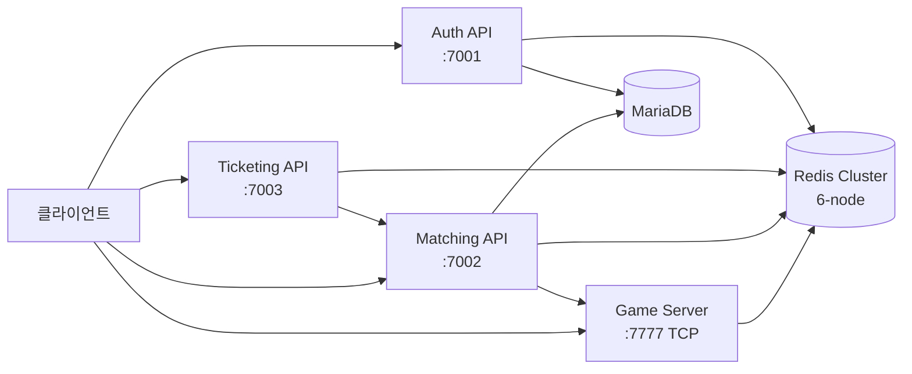

# PlatformA 개발자 문서

**.NET 기반 고성능 분산 멀티플레이어 게임 백엔드 플랫폼**

최대 10,000명 동시 대기열, 200ms 매칭 주기, Redis Cluster 기반 분산 아키텍처를 제공합니다.

---

## 빠른 시작

| 대상 | 시작 위치 |
|------|---------|
| **신규 개발자** | [로컬 환경 세팅](developer-guide/getting-started.md) |
| **아키텍처 파악** | [시스템 개요](architecture/overview.md) |
| **API 연동** | [Auth API 가이드](api-guide/auth.md) |
| **운영/배포** | [배포 가이드](operations/deployment.md) |
| **비개발자** | [PlatformA란?](stakeholder/overview.md) |

---

## 시스템 구성

---

## 서비스 요약

| 서비스 | 역할 | 프로토콜 |
|--------|------|---------|
| **Auth API** | JWT 로그인·갱신·로그아웃 | HTTPS REST |
| **Ticketing API** | 대기열 관리·입장권 발급 | HTTPS REST + SignalR |
| **Matching API** | 1:1 매칭 엔진 | HTTPS REST + SignalR |
| **Game Server** | 실시간 게임 세션·패킷 처리 | TCP Binary (Protobuf) |
| **Utils API** | URL 단축·IP 조회·통계 | HTTPS REST |

---

## 기술 스택

- **런타임**: .NET 8.0 / .NET 9.0 (Matching API)
- **데이터**: Redis 7 Cluster (6-node) · MariaDB (MySQL 8)
- **프로토콜**: REST · SignalR · TCP Binary (Protobuf)
- **인프라**: Docker Compose · Kubernetes (kind/EKS)
- **테스트**: xUnit · 97개 테스트
