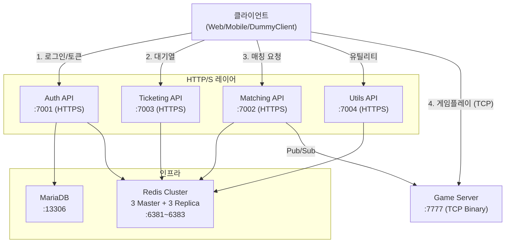

# 배포 가이드

PlatformA는 두 가지 배포 방법을 지원합니다.
- **Docker Compose**: 로컬 개발 환경 및 통합 검증용
- **Kubernetes**: 프로덕션 환경 (예정)

---

## 서비스 포트 맵

| 서비스 | 로컬 개발 포트 | Docker Compose 포트 | 프로토콜 |
|--------|--------------|-------------------|---------|
| Auth API | 7001 (HTTPS) | 7001 (HTTPS) | HTTP/S |
| Matching API | 7002 (HTTPS) | 7002 (HTTPS) | HTTP/S + SignalR |
| Ticketing API | 7003 (HTTPS) | 7003 (HTTPS) | HTTP/S + SignalR |
| Utils API | (launchSettings 참조) | 7004 (HTTPS) | HTTP/S |
| Game Server | 7777 (TCP) | 7777 (TCP) | Binary TCP |
| Redis 노드 1 | 6371 | 6381 | TCP |
| Redis 노드 2 | 6372 | 6382 | TCP |
| Redis 노드 3 | 6373 | 6383 | TCP |
| MariaDB | 3306 | 13306 | TCP |

---

## 전체 아키텍처



---

## 방법 1: Docker Compose (권장 — 로컬 통합 환경)

### 사전 요구사항

- Docker Desktop 설치 및 실행 중
- .NET SDK 8.0 이상 (인증서 생성용)

### 1단계: 개발용 HTTPS 인증서 내보내기

```powershell
# PlatformA/PlatformA.Auth.API 등 각 API가 HTTPS로 동작하므로 인증서가 필요합니다.
cd PlatformA\docker\certs
dotnet dev-certs https --export-path devcert.pfx --password "localdev"
```

> `PlatformA/docker/certs/devcert.pfx` 파일이 생성되면 준비 완료입니다.
> 이 파일은 `.gitignore`에 등록되어 있으므로 커밋하지 않아도 됩니다.

### 2단계: 전체 스택 시작

```powershell
# PlatformA 디렉토리에서 실행
cd PlatformA
docker-compose -f docker/docker-compose.full.yml up -d --build
```

빌드 및 클러스터 초기화까지 약 1~2분 소요됩니다.

### 3단계: 헬스체크

```powershell
# Redis 클러스터 상태 확인
docker exec redis-node-1 redis-cli -p 6379 cluster info | Select-String "cluster_state"

# MariaDB 접속 확인
docker exec mariadb-full mariadb -uroot -ppass1234 -e "SHOW DATABASES;"

# Auth API 응답 확인
Invoke-WebRequest -Uri "https://localhost:7001/api/Auth/login" -Method POST `
  -ContentType "application/json" `
  -Body '{"username":"testuser","password":"test123"}' `
  -SkipCertificateCheck
```

### 4단계: 종료

```powershell
# 컨테이너 종료 (데이터 유지)
docker-compose -f docker/docker-compose.full.yml down

# 컨테이너 + 볼륨 전체 초기화 (데이터 삭제)
docker-compose -f docker/docker-compose.full.yml down -v
```

### 환경 변수 (docker-compose.full.yml 기준)

| 서비스 | 환경 변수 | 기본값 |
|--------|----------|--------|
| auth-api | `JWT_SECRET` | `YourSuperSecretKeyForPlatformAMSA!@#123` |
| auth-api | `REDIS_CONNECTION_STRING` | `redis-node-1:6379,redis-node-2:6379,redis-node-3:6379` |
| auth-api | `MYSQL_WEBAPP_CONNECTION_STRING` | `Server=mariadb;Port=3306;Database=db_WebApp;User=root;Password=pass1234` |
| matching-api | `JWT_SECRET` | (동일) |
| matching-api | `REDIS_CONNECTION_STRING` | (동일) |
| ticketing-api | `QUEUE_BASE_RATE` | `50` |
| ticketing-api | `QUEUE_MAX_RATE` | `500` |
| utils-api | `SNOWFLAKE_WORKER_ID` | `1` |
| utils-api | `SNOWFLAKE_DATACENTER_ID` | `1` |

> **보안 주의**: 프로덕션에서는 `JWT_SECRET`과 `MARIADB_ROOT_PASSWORD`를 반드시 변경하십시오.

---

## 방법 2: 로컬 직접 실행 (개발/디버깅용)

### 의존성 시작 순서

반드시 아래 순서로 시작해야 합니다.

```powershell
# 1. Redis 클러스터 시작 (로컬 Docker)
cd Redis
docker-compose up -d
Start-Sleep -Seconds 15  # 클러스터 초기화 대기

# 2. Redis 클러스터 상태 확인
docker exec -it redis-master-1 redis-cli -p 6371 cluster nodes

# 3. DB 마이그레이션 적용 (최초 실행 또는 신규 마이그레이션 시)
cd PlatformA\PlatformA.MySqlDB.Lib
dotnet ef database update --context DbWebAppContext

# 4. Auth API 실행 (HTTPS :7001)
cd PlatformA\PlatformA.Auth.API
dotnet run

# 5. Ticketing API 실행 (HTTPS :7003)
cd PlatformA\PlatformA.Ticketing.API
dotnet run

# 6. Matching API 실행 (HTTPS :7002)
cd PlatformA\PlatformA.Matching.API
dotnet run

# 7. Game Server 실행 (TCP :7777)
cd PlatformA\PlatformA.Game.Server
dotnet run

# 8. (선택) Utils API 실행
cd PlatformA\PlatformA.Utils.API
dotnet run
```

### DummyClient에서 로컬 서버 연결 시 환경 변수

```powershell
$env:AUTH_API_URL       = "https://localhost:7001/api/Auth/login"
$env:AUTH_API_REFRESH_URL = "https://localhost:7001/api/Auth/refresh"
$env:TICKET_API_URL     = "https://localhost:7003"
$env:MATCH_API_URL      = "https://localhost:7002/api/GameMatch/RequestMatch"
$env:MATCH_HUB_URL      = "https://localhost:7002/hubs/matching"
$env:GAME_SERVER_IP     = "127.0.0.1"
$env:REDIS_CONNECTION_STRING = "127.0.0.1:6381,127.0.0.1:6382,127.0.0.1:6383"
```

---

## 방법 3: 개별 Docker 이미지 빌드

```powershell
# PlatformA 디렉토리에서 실행 (Dockerfile이 이 컨텍스트를 기준으로 작성됨)
cd PlatformA

# Auth API
docker build -f PlatformA.Auth.API/Dockerfile -t platformA-auth:latest .

# Matching API
docker build -f PlatformA.Matching.API/Dockerfile -t platformA-matching:latest .

# Ticketing API
docker build -f PlatformA.Ticketing.API/Dockerfile -t platformA-ticketing:latest .

# Utils API
docker build -f PlatformA.Utils.API/Dockerfile -t platformA-utils:latest .

# Game Server
docker build -f PlatformA.Game.Server/Dockerfile -t platformA-game:latest .
```

---

## DB 마이그레이션

```powershell
cd PlatformA\PlatformA.MySqlDB.Lib

# WebApp DB 마이그레이션 생성
dotnet ef migrations add <마이그레이션이름> --context DbWebAppContext --output-dir Migrations/WebApp

# WebApp DB 마이그레이션 적용
dotnet ef database update --context DbWebAppContext

# LogApp DB 마이그레이션 생성
dotnet ef migrations add <마이그레이션이름> --context DbLogAppContext --output-dir Migrations/LogApp

# LogApp DB 마이그레이션 적용
dotnet ef database update --context DbLogAppContext
```

---

## 트러블슈팅

### Redis 클러스터 연결 실패

```powershell
# 클러스터 상태 확인
docker exec redis-node-1 redis-cli -p 6379 cluster info

# 클러스터 초기화가 완료되지 않은 경우 재시작
docker-compose -f docker/docker-compose.full.yml restart redis-cluster-init
```

### MariaDB 접속 실패

```powershell
# 헬스체크 상태 확인
docker inspect mariadb-full --format "{{.State.Health.Status}}"

# 로그 확인
docker logs mariadb-full --tail 50
```

### HTTPS 인증서 오류 (개발 환경)

```powershell
# 인증서 재생성
dotnet dev-certs https --clean
dotnet dev-certs https --trust
cd PlatformA\docker\certs
dotnet dev-certs https --export-path devcert.pfx --password "localdev"
```

### 빌드 오류

```powershell
# 전체 솔루션 클린 빌드
cd PlatformA
dotnet clean PlatformA.sln
dotnet build PlatformA.sln
```
