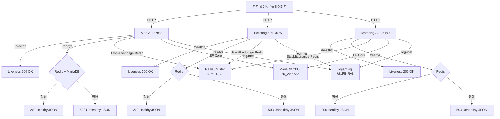

# 모니터링 가이드

이 문서는 PlatformA 각 서비스의 헬스체크 엔드포인트, 로그 레벨 설정, Redis/MariaDB 연결 상태 확인 방법을 설명합니다.

---

## 헬스체크 엔드포인트

모든 HTTP API 서비스는 두 가지 헬스체크 엔드포인트를 공통으로 제공합니다.

| 엔드포인트 | 용도 | 응답 형식 |
|---|---|---|
| `GET /healthz` | Liveness — 프로세스 생존 여부 확인 (외부 의존성 체크 없음) | `200 Healthy` (텍스트) |
| `GET /readyz` | Readiness — 외부 의존성(Redis, MariaDB) 연결 가능 여부 확인 | `200 / 503` (JSON) |

### 서비스별 헬스체크 URL

| 서비스 | Liveness | Readiness | 체크 항목 |
|---|---|---|---|
| Auth API | `http://localhost:7088/healthz` | `http://localhost:7088/readyz` | Redis + MariaDB (db_WebApp) |
| Ticketing API | `http://localhost:7075/healthz` | `http://localhost:7075/readyz` | Redis |
| Matching API | `http://localhost:5189/healthz` | `http://localhost:5189/readyz` | Redis |
| Utils API | 헬스체크 미등록 | 헬스체크 미등록 | — |

> Utils API(`PlatformA.Utils.API`)는 Program.cs에 헬스체크가 등록되어 있지 않습니다.

### Readiness 응답 예시

```json
{
  "status": "Healthy",
  "duration": 12.34,
  "checks": {
    "redis": {
      "status": "Healthy",
      "description": null,
      "duration": 3.21
    },
    "mysql-webapp": {
      "status": "Healthy",
      "description": "MariaDB db_WebApp 연결 정상",
      "duration": 8.12
    }
  }
}
```

비정상 시 HTTP 상태 코드는 `503 Service Unavailable`이며, `status` 필드 값이 `Unhealthy`로 반환됩니다.

### 헬스체크 확인 명령

```bash
# Auth API liveness 확인
curl -f http://localhost:7088/healthz

# Auth API readiness 확인 (Redis + MariaDB)
curl -s http://localhost:7088/readyz | python -m json.tool

# Ticketing API readiness 확인 (Redis)
curl -s http://localhost:7075/readyz | python -m json.tool

# Matching API readiness 확인 (Redis)
curl -s http://localhost:5189/readyz | python -m json.tool
```

---

## 로그 설정

### 로깅 아키텍처

모든 HTTP API 서비스(Auth, Ticketing, Matching API)는 ASP.NET Core 기본 콘솔 프로바이더를 제거하고 **log4net**을 단일 로깅 프로바이더로 사용합니다. Utils API는 log4net 설정 없이 기본 ASP.NET Core 로깅을 사용합니다.

### 로그 레벨

| 대상 | 레벨 | 설명 |
|---|---|---|
| 루트 로거 (애플리케이션 코드) | `INFO` | INFO 이상 모든 로그 출력 |
| `Microsoft.*` (프레임워크 내부) | `WARN` | 노이즈 감소를 위해 WARN 이상만 출력 |

### 로그 파일 경로

각 서비스는 실행 디렉토리 기준으로 날짜별 롤링 파일에 로그를 기록합니다.

| 서비스 | 로그 파일 경로 패턴 |
|---|---|
| Auth API | `logs/auth-api-yyyyMMdd.log` |
| Ticketing API | `logs/ticketing-api-yyyyMMdd.log` |
| Matching API | `logs/matching-api-yyyyMMdd.log` |

**롤링 정책**: 날짜 + 크기(10MB) 복합 방식, 최대 10개 파일 보관

### 로그 포맷

```
# 콘솔 출력 (짧은 형식)
HH:mm:ss.fff [LEVEL] LoggerName - 메시지

# 파일 출력 (상세 형식)
yyyy-MM-dd HH:mm:ss.fff [ThreadId] LEVEL LoggerName - 메시지
```

### 로그 레벨 변경

로그 레벨 변경은 각 서비스의 `log4net.config` 파일에서 수행합니다. `appsettings.json`은 로그 레벨을 관리하지 않습니다.

```xml
<!-- log4net.config — 루트 로거 레벨 변경 예시 -->
<root>
  <level value="DEBUG" />  <!-- INFO → DEBUG로 변경 -->
  <appender-ref ref="ConsoleAppender" />
  <appender-ref ref="RollingFileAppender" />
</root>
```

> 변경 후 서비스를 재시작해야 적용됩니다.

---

## Redis 연결 상태 확인

### 클러스터 구성

PlatformA는 Redis 7.x 클러스터를 사용합니다 (마스터 3개, 슬레이브 3개).

| 노드 | 역할 | 포트 |
|---|---|---|
| redis-master-1 | Master | 6371 |
| redis-master-2 | Master | 6372 |
| redis-master-3 | Master | 6373 |
| redis-slave-1~3 | Replica | 6374~6376 |

연결 문자열 (기본값, `REDIS_CONNECTION_STRING` 환경변수로 오버라이드 가능):
```
127.0.0.1:6371,127.0.0.1:6372,127.0.0.1:6373
```

### 클러스터 상태 확인 명령

```bash
# 클러스터 전체 상태 확인
docker exec redis-master-1 redis-cli -p 6371 cluster info

# 정상 출력 예시:
# cluster_state:ok
# cluster_slots_assigned:16384
# cluster_known_nodes:6

# 노드 목록 확인
docker exec redis-master-1 redis-cli -p 6371 cluster nodes

# 각 마스터 ping 테스트
redis-cli -p 6371 ping
redis-cli -p 6372 ping
redis-cli -p 6373 ping
```

### 주요 Redis 키 확인

```bash
# 대기열 상태 확인
redis-cli -p 6371 ZCARD "{ticket:queue}:global"
redis-cli -p 6371 ZRANGE "{ticket:queue}:global" 0 -1 WITHSCORES

# 하트비트 상태 확인
redis-cli -p 6371 HGETALL "{ticket:queue}:heartbeats"

# Active 유저 수 확인
redis-cli -p 6371 KEYS "ticket:active:user:*"

# 매칭 대기열 상태 확인
redis-cli -p 6371 ZCARD "queue:gamematch:1v1"
redis-cli -p 6371 ZRANGE "queue:gamematch:1v1" 0 -1 WITHSCORES
```

---

## MariaDB 연결 상태 확인

### 데이터베이스 구성

| DB 이름 | 용도 | EF Core Context |
|---|---|---|
| `db_WebApp` | 플레이어, 아이템, 매칭 기록 | `DbWebAppContext` |
| `db_LogApp` | 접속 로그 | `DbLogAppContext` |

### 연결 확인 명령

```bash
# MySQL 서버 접속 가능 여부 확인
mysql -u root -ppass1234 -e "SELECT 1;"

# 데이터베이스 목록 확인
mysql -u root -ppass1234 -e "SHOW DATABASES;"

# db_WebApp 테이블 목록 확인
mysql -u root -ppass1234 -e "USE db_WebApp; SHOW TABLES;"

# Migration 히스토리 확인 (EF Core)
mysql -u root -ppass1234 -e "SELECT * FROM db_WebApp.__EFMigrationsHistory;"
```

### EF Core Migration 상태 확인

```bash
cd PlatformA/PlatformA.MySqlDB.Lib

# 적용된 Migration 목록
dotnet ef migrations list --context DbWebAppContext
dotnet ef migrations list --context DbLogAppContext
```

---

## 모니터링 흐름


