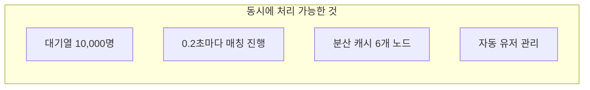

# PlatformA란 무엇인가요?

PlatformA는 **온라인 멀티플레이어 게임을 운영하기 위한 서버 시스템**입니다.  
게임 클라이언트(앱이나 웹 게임)가 여러 플레이어를 연결하고, 공정하게 대기시키고, 적절한 상대와 매칭해 주는 모든 과정을 처리합니다.

---

## 쉽게 말하면: "스마트 놀이공원 운영 시스템"

PlatformA의 역할을 놀이공원에 비유하면 이렇습니다:

| PlatformA 서비스 | 놀이공원 비유 | 하는 일 |
|-----------------|-------------|--------|
| **Auth API** | 입구 신분 확인소 | 플레이어의 신원을 확인하고 입장 팔찌(토큰)를 발급 |
| **Ticketing API** | 어트랙션 대기 번호표 발권기 | 게임 대기열에 줄을 세우고 순서가 되면 번호표(입장권) 발급 |
| **Matching API** | 짝 맞춰주는 안내원 | 비슷한 수준의 플레이어 2명을 찾아 같은 게임방으로 안내 |
| **Game Server** | 실제 어트랙션 공간 | 두 플레이어가 실시간으로 게임을 즐기는 공간 |

---

## 핵심 수치

| 항목 | 수치 |
|------|------|
| 최대 동시 대기 인원 | **10,000명** |
| 매칭 처리 주기 | **200ms** (0.2초마다) |
| 입장권 유효 시간 | **5분** |
| Access Token 유효 시간 | **15분** |
| Refresh Token 유효 시간 | **7일** |

---

## 보안 특징

PlatformA는 다음과 같은 방식으로 보안을 유지합니다:

- **1회용 입장권**: 게임 서버에 접속하면 입장권이 즉시 회수됩니다. 같은 입장권으로 두 번 입장할 수 없습니다.
- **자동 만료**: 대기 중 5분 이상 응답이 없으면 대기열에서 자동으로 제거됩니다. (이른바 "유령 유저" 방지)
- **중복 로그인 방지**: 동일 계정으로 두 곳에서 동시에 게임 서버에 접속할 수 없습니다.
- **요청 횟수 제한**: 로그인 API는 1분에 최대 10회, 대기열 API는 1초에 최대 5회로 제한됩니다. (과부하 방지)

---

## 시스템이 처리하는 규모

---

## 기술 독립성

PlatformA는 특정 게임 장르에 종속되지 않습니다. 다음과 같은 게임에 적용할 수 있습니다:

- 1:1 대전 게임 (현재 기본 지원)
- 팀 대전 (N명 매칭으로 확장 가능)
- 실시간 멀티플레이어 게임

---

> 기술적인 세부 내용이 궁금하시면 [아키텍처 개요](../architecture/overview.md) 페이지를 참고하세요.
