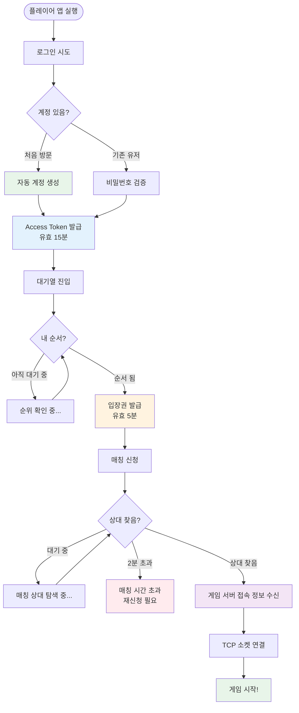
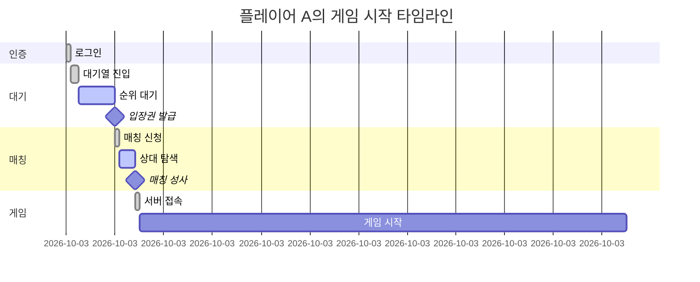

# 게임 플레이어 여정

한 플레이어가 PlatformA를 통해 게임을 시작하기까지의 과정을 순서대로 설명합니다.

---

## 전체 흐름

---

## 단계별 설명

### 1단계: 로그인

플레이어가 사용자 이름과 비밀번호를 입력합니다.

- **처음 방문하는 경우**: 별도 회원가입 없이 자동으로 계정이 만들어집니다.
- **기존 유저**: 저장된 비밀번호와 대조하여 본인 확인 후 입장합니다.
- 로그인 성공 시 **Access Token**(15분)과 **Refresh Token**(7일)을 발급받습니다.

> **비유**: 놀이공원 입구에서 신분증 확인 후 입장 팔찌를 받는 것과 같습니다.

---

### 2단계: 대기열 진입

게임을 하고 싶은 플레이어는 대기열에 입장합니다.

- 입장한 순서대로 줄이 만들어집니다.
- 앱은 자동으로 내 순위를 주기적으로 확인합니다. (스마트 폴링)
- 순위가 높아질수록 폴링 주기가 짧아집니다.
- 5분 이상 응답이 없으면 자동으로 대기열에서 제거됩니다.

> **비유**: 인기 어트랙션 앞에서 번호표를 뽑고 기다리는 것과 같습니다.

---

### 3단계: 입장권 발급

대기열 앞쪽 플레이어들에게 자동으로 **입장권**이 발급됩니다.

- 입장권은 **5분간 유효**합니다. 5분 내에 게임 서버에 접속해야 합니다.
- 입장권은 **1회용**입니다. 게임 서버에 접속하면 즉시 사라집니다.

> **비유**: 번호표가 호출되어 실제 어트랙션 입장 직전에 받는 탑승권과 같습니다.

---

### 4단계: 매칭

입장권을 받은 플레이어가 매칭을 신청하면, 시스템이 상대를 찾아줍니다.

- 시스템은 **0.2초마다** 대기 중인 플레이어들을 2명씩 짝지어줍니다.
- 먼저 대기열에 들어온 순서로 매칭됩니다. (공정한 FIFO 방식)
- **2분 이내**에 상대를 못 찾으면 매칭이 취소됩니다. 다시 신청할 수 있습니다.
- 매칭 성사 시 앱에 알림이 옵니다.

> **비유**: 안내원이 "같이 탑승할 2인조"를 찾아주는 것과 같습니다.

---

### 5단계: 게임 시작

매칭이 성사되면 게임 서버 접속 정보(IP, 포트, 방 번호)를 받습니다.

- 게임 서버에 직접 연결(TCP)하여 실시간 게임을 시작합니다.
- **중복 접속 불가**: 한 계정으로 동시에 두 게임에 참여할 수 없습니다.

---

## 타임라인 예시

*평균 소요 시간: 약 1분 30초 (대기열 상황에 따라 변동)*
