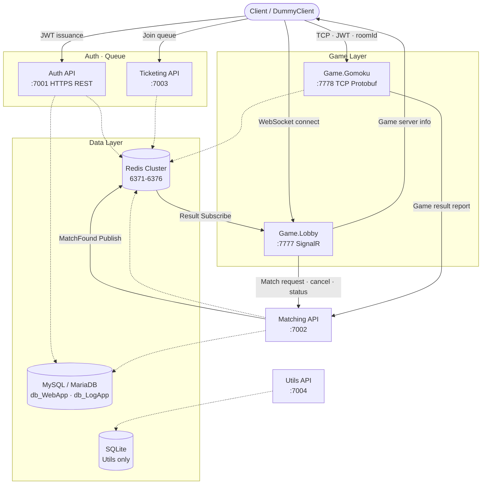
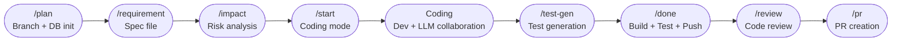

# PlatformA

[](https://github.com/rumdice/platformA)


> [한국어](README.md) | **English**

**High-performance distributed multiplayer game backend built on .NET 10.**

- **ELO-based matchmaking** with 3-stage range expansion (±200 → ±400 → ±800) and K-factor dampening to prevent MMR dilution
- **Redis Cluster** (3 master + 3 replica) for distributed state, rate limiting, and atomic Lua operations
- **Dual-protocol game server**: REST/SignalR for lobby & matchmaking, TCP Protobuf for real-time gameplay

---

## Architecture



### Main User Flow

```text
Authenticate
→ Join queue
→ Connect to Lobby
→ Request match via Matching API
→ Receive MatchFound notification
→ Get game server connection info
→ Connect to Gomoku TCP server
→ Play game
→ Report game result
```

---

## Services

| Service | Port | Protocol | Role |
|---------|------|----------|------|
| **Auth API** | 7001 | HTTPS REST | JWT issuance & refresh, BCrypt auth, auto-register new users |
| **Ticketing API** | 7003 | HTTPS REST + SignalR | Queue management, entry ticket issuance |
| **Matching API** | 7002 | HTTPS REST + SignalR | 1v1 ELO matchmaking, match records, game start & result reporting |
| **Game.Lobby** | 7777 | HTTP + SignalR | Lobby hub, match request relay, user presence, MatchFound delivery |
| **Game.Gomoku** | 7778 | TCP Binary (Protobuf) | Real-time Gomoku PvP game server |
| **Utils API** | 7004 | HTTPS REST | URL shortening (Snowflake + Base62), click analytics |

---

## Tech Stack

| Category | Technology | Key Packages |
|----------|-----------|-------------|
| **Runtime** | .NET 10.0 (C#) | — |
| **Database** | MariaDB/MySQL (EF Core) · SQLite | `Pomelo.EntityFrameworkCore.MySql` · `Microsoft.EntityFrameworkCore.Sqlite` |
| **Cache / State** | Redis Cluster | `StackExchange.Redis` 2.10.1 · `RedLock.net` 2.3.2 |
| **Communication** | REST · SignalR WebSocket · TCP Binary | `Google.Protobuf` 3.29.3 · ASP.NET Core SignalR |
| **Auth** | JWT (15 min access + 7 day refresh) · BCrypt | `System.IdentityModel.Tokens.Jwt` 8.16 · `BCrypt.Net-Next` 4.0.3 |
| **Resilience** | Circuit breaker · Retry · Rate limiting | `Polly` 8.4.1 · Redis Lua scripts |
| **I/O** | High-perf buffer management | `System.IO.Pipelines` 10.0 |
| **Logging** | Structured logging | `log4net` 2.0.17 |
| **API Docs** | OpenAPI / Scalar UI | `Microsoft.AspNetCore.OpenApi` · `Scalar.AspNetCore` 2.14 |
| **Infrastructure** | Container · CI | Docker · GitHub Actions |
| **Testing** | Unit & integration tests | `xUnit` · `Moq` · InMemory DB — 6 test projects |

> Test counts change frequently as features are added; they are not fixed in this README. Check `dotnet test` output or CI results for the latest numbers.

---

## AI-Assisted Development Workflow

This project is developed using an AI-assisted SDLC pipeline powered by **Claude Code**.
Every feature goes through the following automated stages:



| Stage | Tool | What happens |
|-------|------|-------------|
| `/plan` | Claude Code | Creates feature branch, registers sprint in SDLC DB |
| `/requirement` | Claude Code | Writes spec file, checks ADR conflicts |
| `/impact` | Claude Code | Classifies risk (HIGH / MEDIUM / LOW), checks references |
| `/start` | Claude Code | Claims job lock, transitions to coding mode |
| Coding | Dev + LLM | Developer defines design direction & boundaries; LLM assists with implementation |
| `/test-gen` | Claude Code + `test-writer` agent | Generates xUnit tests reusing existing factory patterns |
| `/done` | Claude Code | Runs `dotnet build`, `dotnet format`, `dotnet test`; pushes only on full pass |
| `/review` | Dev + Claude Code | Reviews execution flow, ADR compliance, security, DI, Redis keys, concurrency |
| `/pr` | Claude Code + GitHub CLI | Creates PR, archives spec, records cost log |

### Workflow Infrastructure

```text
Claude Code (LLM)  ─── assists with code, drives pipeline
       │
       ├── PostgreSQL (SDLC DB)  ─── tracks job/step/gate state
       ├── n8n                   ─── orchestrates GitHub ↔ DB events
       └── GitHub Actions        ─── CI: build, test, lint
```

### AI Workflow Tech Stack

| Category | Tool | Version / Notes |
|----------|------|----------------|
| LLM Agent | Claude Code | claude-sonnet-4-6 |
| SDLC State DB | PostgreSQL | `platforma_sdlc` schema, `sdlc.ai_jobs` table |
| Orchestration | n8n | GitHub ↔ DB event bridge |
| CI/CD | GitHub Actions | Build, test, lint only |
| PR Management | GitHub CLI (`gh`) | PR creation, queries, labels |
| DB Scripts | Python + psycopg2 | `.github/scripts/db_write.py` — local only |
| Sprint Tracking | Markdown (`AI/sprints/`) | `sprint-NNN.md` with YAML frontmatter |
| Architecture Decisions | ADR (`AI/adr/`) | Architectural decision records |

> See [`CLAUDE.md`](CLAUDE.md) for the full workflow definition and [`AI/adr/`](AI/adr/) for architectural decisions.

---

## Quick Start

### Prerequisites

- [.NET 10 SDK](https://dotnet.microsoft.com/download)
- [Docker Desktop](https://www.docker.com/products/docker-desktop)
- MySQL / MariaDB running on `localhost:3306`
- A local DB account and password
- If EF Core CLI is missing: `dotnet tool install --global dotnet-ef`

> Keep passwords and connection strings out of source code and public docs. Use User Secrets, environment variables, or local-only configuration instead.

### 1. Start Redis Cluster

```bash
cd PlatformA/docker/redis-cluster
docker compose up -d
```

### 2. Initialize Databases (first run only)

Omitting the password after `-p` lets the CLI prompt you securely.

```bash
mysql -u root -p -e "CREATE DATABASE IF NOT EXISTS db_WebApp; CREATE DATABASE IF NOT EXISTS db_LogApp;"
```

### 3. Apply EF Core Migrations

```bash
cd PlatformA/PlatformA.MySqlDB.Lib
dotnet ef database update --context DbWebAppContext
dotnet ef database update --context DbLogAppContext
```

### 4. Run Services

Open a separate terminal for each service:

```bash
cd PlatformA/PlatformA.Auth.API      && dotnet run   # https://localhost:7001
cd PlatformA/PlatformA.Ticketing.API && dotnet run   # https://localhost:7003
cd PlatformA/PlatformA.Matching.API  && dotnet run   # https://localhost:7002
cd PlatformA/PlatformA.Game.Lobby    && dotnet run   # http://localhost:7777
cd PlatformA/PlatformA.Game.Gomoku   && dotnet run   # tcp://localhost:7778
```

> **Recommended order:** When validating the full user flow, start services in the order above: Auth → Ticketing → Matching → Lobby → Gomoku.  
> Matching API's readiness dependencies are Redis and MySQL; Auth API is not a direct startup dependency for Matching API.

### 5. Health Check

Services that support it expose these endpoints:

```text
/healthz  → process liveness
/readyz   → readiness including Redis, DB, and other external dependencies
```

---

## API Documentation

Auto-generated guides are in [`Docs/api-guide/`](Docs/api-guide/):

| Guide | Coverage |
|-------|----------|
| [`auth.md`](Docs/api-guide/auth.md) | Login, token refresh, logout |
| [`ticketing.md`](Docs/api-guide/ticketing.md) | Queue entry, status, entry ticket |
| [`matching.md`](Docs/api-guide/matching.md) | Match request, cancel, result reporting |
| [`utils.md`](Docs/api-guide/utils.md) | URL shorten, redirect, statistics |
| [`game-server-protocol.md`](Docs/api-guide/game-server-protocol.md) | TCP packet format (Protobuf) |

---

## Running Tests

```bash
cd PlatformA
dotnet test PlatformA.sln -q
```

| Test Project | Focus |
|-------------|-------|
| `PlatformA.Tests.Auth.API` | JWT, BCrypt, registration |
| `PlatformA.Tests.Ticketing.API` | Queue logic, rate limits |
| `PlatformA.Tests.Matching.API` | ELO matching, DB fallback |
| `PlatformA.Tests.Utils.API` | URL shortening, Base62 |
| `PlatformA.Tests.Game.Gomoku` | Game logic, win detection |
| `PlatformA.Tests.Game.Lobby` | SignalR hub, match flow |

When updating test counts in documentation, do not manually sum per-project numbers — use the actual `dotnet test` or CI output as the authoritative source.

---

## Project Structure

```text
platformA/
├── README.md
├── README.en.md
├── PlatformA/
│   ├── PlatformA.sln
│   ├── PlatformA.Library/           # Shared: Redis, JWT, TCP, Packet base
│   ├── PlatformA.Library.Game/      # Game infra: GameSession, GameRoom
│   ├── PlatformA.MySqlDB.Lib/       # EF Core contexts & migrations
│   ├── PlatformA.SdlcDB.Lib/        # SDLC PostgreSQL data layer
│   ├── PlatformA.Auth.API/          # Authentication service
│   ├── PlatformA.Ticketing.API/     # Queue management service
│   ├── PlatformA.Matching.API/      # Matchmaking service
│   ├── PlatformA.Game.Lobby/        # Lobby hub (SignalR)
│   ├── PlatformA.Game.Gomoku/       # Gomoku game server (TCP)
│   ├── PlatformA.Utils.API/         # URL shortening service
│   ├── PlatformA.Game.DummyClient/  # E2E test client
│   └── PlatformA.Tests.*/           # Test projects
├── AI/
│   ├── ARCHITECTURE.md              # System design overview
│   ├── adr/                         # Architectural Decision Records
│   ├── sprints/                     # Sprint history
│   └── workreport/                  # Daily work reports
└── Docs/
    ├── api-guide/                   # API documentation
    ├── architecture/                # Sequence diagrams, DB schema
    └── developer-guide/             # Game server · packet · dev guides
```

---

## Documentation Maintenance

- Root `README.md` is the authoritative project overview document.
- `README.en.md` must maintain the same structure and core facts as the Korean README.
- If `PlatformA/README.md` exists separately, scope it to local run instructions only and remove unrelated template content.
- Values that change frequently (ports, package versions, test counts) must be verified against code or CI results before updating.
- Keep Mermaid service connections aligned with actual call directions in the code.

---

## Contributing

All changes go through a branch workflow:

```text
Create feature branch
→ Record requirements and impact scope
→ Implement
→ Build & test
→ Code review
→ Pull request into main
```

See [`CLAUDE.md`](CLAUDE.md) for the full AI-assisted SDLC pipeline used in this project.
