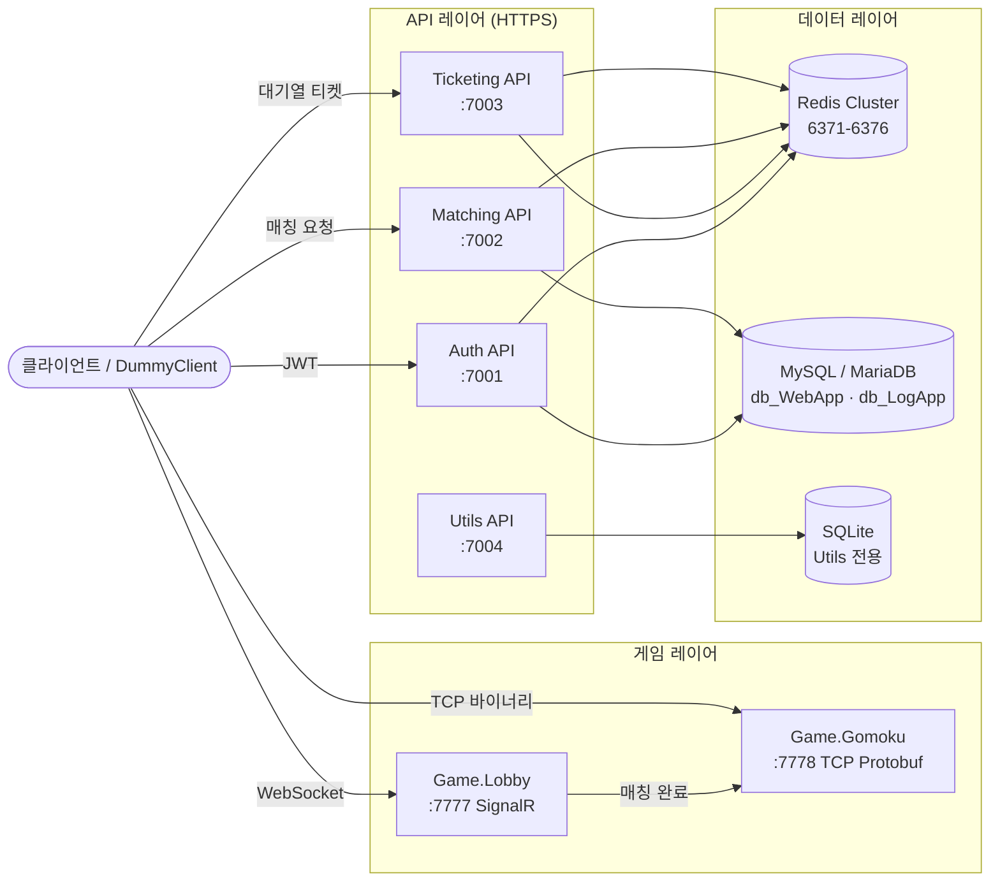
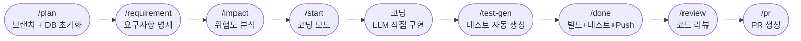

# PlatformA


> **한국어** | [English](README.en.md)

**.NET 10 기반 고성능 분산 멀티플레이어 게임 백엔드 플랫폼.**

- **ELO 기반 매칭**: 3단계 범위 확장(±200 → ±400 → ±800) + K-factor 감소로 MMR 희석 방지
- **Redis Cluster** (Master 3 + Replica 3): 분산 상태 관리, Rate Limiting, Lua 스크립트 원자성 보장
- **이중 프로토콜 게임 서버**: 로비·매칭은 REST/SignalR, 실시간 게임플레이는 TCP Protobuf

---

## 아키텍처



---

## 서비스 목록

| 서비스 | 포트 | 프로토콜 | 역할 |
|--------|------|---------|------|
| **Auth API** | 7001 | HTTPS REST | JWT 발급·갱신·로그아웃, BCrypt 인증, 신규 유저 자동 등록 |
| **Ticketing API** | 7003 | HTTPS REST + SignalR | 대기열 관리 (최대 10,000명), 입장권 발급 |
| **Matching API** | 7002 | HTTPS REST + SignalR | 1v1 ELO 매칭, 매치 기록, 결과 보고 |
| **Game.Lobby** | 7777 | HTTP + SignalR | 로비 허브, 매칭 신청, 유저 프레젠스 |
| **Game.Gomoku** | 7778 | TCP Binary (Protobuf) | 실시간 오목 PvP 게임 서버 |
| **Utils API** | 7004 | HTTPS REST | URL 단축 (Snowflake + Base62), 클릭 통계 |

---

## 기술 스택

| 분류 | 기술 | 주요 패키지 |
|------|------|-----------|
| **런타임** | .NET 10.0 (C#) | — |
| **데이터베이스** | MariaDB/MySQL (EF Core) · SQLite | `Pomelo.EntityFrameworkCore.MySql` · `Microsoft.EntityFrameworkCore.Sqlite` |
| **캐시 / 상태** | Redis Cluster | `StackExchange.Redis` 2.10.1 · `RedLock.net` 2.3.2 |
| **통신** | REST · SignalR WebSocket · TCP Binary | `Google.Protobuf` 3.29.3 · `Microsoft.AspNetCore.SignalR` |
| **인증** | JWT (Access 15분 + Refresh 7일) · BCrypt | `System.IdentityModel.Tokens.Jwt` 8.16 · `BCrypt.Net-Next` 4.0.3 |
| **내결함성** | 서킷 브레이커 · 재시도 · Rate Limiting | `Polly` 8.4.1 · Redis Lua 스크립트 |
| **I/O** | 고성능 버퍼 관리 | `System.IO.Pipelines` 10.0 |
| **로깅** | 구조적 로깅 | `log4net` 2.0.17 |
| **API 문서** | OpenAPI / Scalar UI | `Microsoft.AspNetCore.OpenApi` · `Scalar.AspNetCore` 2.14 |
| **인프라** | 컨테이너 · CI | Docker · GitHub Actions |
| **테스트** | 단위·통합 테스트 | `xUnit` · `Moq` · InMemory DB — 255개 / 6개 프로젝트 |

---

## AI 기반 개발 워크플로우

이 프로젝트는 **Claude Code**를 활용한 AI 지원 SDLC 파이프라인으로 개발된다.  
모든 기능은 아래의 자동화된 단계를 거쳐 PR로 완성된다.



| 단계 | 도구 | 수행 내용 |
|------|------|---------|
| `/plan` | Claude Code | 기능 브랜치 생성, SDLC DB에 스프린트 등록 |
| `/requirement` | Claude Code | 명세 파일 작성, ADR 충돌 검사 |
| `/impact` | Claude Code | 위험도 분류 (HIGH / MEDIUM / LOW), 참조 관계 확인 |
| `/start` | Claude Code | Job Lock 획득, 코딩 모드 전환 |
| 코딩 | LLM (Claude) | 명세 기반 파일별 순차 구현 |
| `/test-gen` | Claude Code + `test-writer` 에이전트 | 기존 팩토리 패턴을 정확히 재사용하는 xUnit 테스트 생성 |
| `/done` | Claude Code | `dotnet build` → `dotnet format` → `dotnet test` 전부 통과 시 Push |
| `/review` | Claude Code | ADR 준수, 보안, DI, Redis 키 규칙 검사 |
| `/pr` | Claude Code + GitHub CLI | PR 생성, 명세 파일 archived, 비용 로그 기록 |

**워크플로우 인프라 구성:**

```
Claude Code (LLM)  ─── 코드 작성, 파이프라인 구동
       │
       ├── PostgreSQL (SDLC DB)  ─── job/step/gate 상태 추적
       ├── n8n                   ─── GitHub ↔ DB 이벤트 오케스트레이션
       └── GitHub Actions        ─── CI: 빌드·테스트·린트 (읽기 전용; DB 접근 금지)
```

> 전체 워크플로우 정의는 [`CLAUDE.md`](CLAUDE.md), 아키텍처 결정 이력은 [`AI/adr/`](AI/adr/) 참조.

---

## 빠른 시작

### 사전 요구사항

- [.NET 10 SDK](https://dotnet.microsoft.com/download)
- [Docker Desktop](https://www.docker.com/products/docker-desktop)
- MySQL / MariaDB (`localhost:3306`, root 비밀번호: `pass1234`)

### 1. Redis 클러스터 시작

```bash
cd PlatformA/docker/redis-cluster
docker-compose up -d
```

### 2. 데이터베이스 초기화 (최초 1회)

```bash
mysql -u root -ppass1234 -e "CREATE DATABASE IF NOT EXISTS db_WebApp; CREATE DATABASE IF NOT EXISTS db_LogApp;"
```

### 3. EF Core 마이그레이션 적용

```bash
cd PlatformA/PlatformA.MySqlDB.Lib
dotnet ef database update --context DbWebAppContext
dotnet ef database update --context DbLogAppContext
```

### 4. 서비스 실행

각 서비스를 별도 터미널에서 실행:

```bash
cd PlatformA/PlatformA.Auth.API      && dotnet run   # https://localhost:7001
cd PlatformA/PlatformA.Ticketing.API && dotnet run   # https://localhost:7003
cd PlatformA/PlatformA.Matching.API  && dotnet run   # https://localhost:7002
cd PlatformA/PlatformA.Game.Lobby    && dotnet run   # http://localhost:7777
cd PlatformA/PlatformA.Game.Gomoku   && dotnet run   # tcp://localhost:7778
```

> **주의**: 위 순서대로 실행해야 한다. Auth API가 정상 상태여야 Matching API가 매칭을 시작할 수 있다.

---

## API 문서

자동 생성 API 가이드는 [`Docs/api-guide/`](Docs/api-guide/)에 있다:

| 가이드 | 내용 |
|--------|------|
| [`auth.md`](Docs/api-guide/auth.md) | 로그인, 토큰 갱신, 로그아웃 |
| [`ticketing.md`](Docs/api-guide/ticketing.md) | 대기열 진입, 상태 조회, 입장권 |
| [`matching.md`](Docs/api-guide/matching.md) | 매칭 요청, 취소, 결과 보고 |
| [`utils.md`](Docs/api-guide/utils.md) | URL 단축, 리다이렉트, 통계 |
| [`game-server-protocol.md`](Docs/api-guide/game-server-protocol.md) | TCP 패킷 포맷 (Protobuf) |

---

## 테스트 실행

```bash
cd PlatformA
dotnet test PlatformA.sln -q
```

| 테스트 프로젝트 | 테스트 수 | 대상 |
|--------------|---------|------|
| `Tests.Auth.API` | 24 | JWT, BCrypt, 회원가입 |
| `Tests.Ticketing.API` | 21 | 대기열 로직, Rate Limit |
| `Tests.Matching.API` | 37 | ELO 매칭, DB 폴백 |
| `Tests.Utils.API` | 28 | URL 단축, Base62 |
| `Tests.Game.Gomoku` | 62 | 게임 로직, 승리 판정 |
| `Tests.Game.Lobby` | 64 | SignalR 허브, 매칭 흐름 |
| **합계** | **255** | |

---

## 프로젝트 구조

```
platformA/
├── PlatformA/
│   ├── PlatformA.sln
│   ├── PlatformA.Library/           # 공통: Redis, JWT, Consts, TCP 기반
│   ├── PlatformA.Library.Game/      # 게임 인프라: GameSession, GameRoom, JobQueue
│   ├── PlatformA.MySqlDB.Lib/       # EF Core 컨텍스트 & 마이그레이션
│   ├── PlatformA.Auth.API/          # 인증 서비스
│   ├── PlatformA.Ticketing.API/     # 대기열 관리 서비스
│   ├── PlatformA.Matching.API/      # 매칭 서비스
│   ├── PlatformA.Game.Lobby/        # 로비 허브 (SignalR)
│   ├── PlatformA.Game.Gomoku/       # 오목 게임 서버 (TCP)
│   ├── PlatformA.Utils.API/         # URL 단축 서비스
│   ├── PlatformA.Game.DummyClient/  # E2E 테스트 클라이언트
│   └── PlatformA.Tests.*/           # 테스트 프로젝트 (6개)
├── AI/
│   ├── ARCHITECTURE.md              # 시스템 설계 개요
│   ├── adr/                         # 아키텍처 결정 기록 (11개)
│   ├── sprints/                     # 스프린트 이력
│   └── workreport/                  # 일일 작업 리포트
└── Docs/
    ├── api-guide/                   # API 문서
    └── architecture/                # 시퀀스 다이어그램, DB 스키마
```

---

## 기여 가이드

모든 변경은 브랜치 워크플로우를 통해 진행한다: 기능 브랜치 생성 → 구현 → 빌드·테스트 → main으로 PR.  
전체 AI 지원 SDLC 파이프라인은 [`CLAUDE.md`](CLAUDE.md) 참조.
