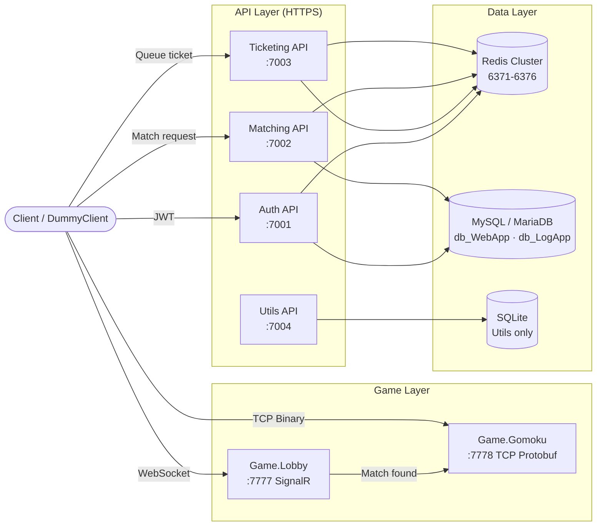

# PlatformA


**High-performance distributed multiplayer game backend built on .NET 10.**

- **ELO-based matchmaking** with 3-stage range expansion (±200 → ±400 → ±800) and K-factor dampening
- **Redis Cluster** (3 master + 3 replica) for distributed state, rate limiting, and atomic Lua operations
- **Dual-protocol game server**: REST/SignalR for lobby & matchmaking, TCP Protobuf for real-time gameplay

---

## Architecture



---

## Services

| Service | Port | Protocol | Role |
|---------|------|----------|------|
| **Auth API** | 7001 | HTTPS REST | JWT issuance & refresh, BCrypt auth, auto-register |
| **Ticketing API** | 7003 | HTTPS REST + SignalR | Queue management (max 10,000), entry tickets |
| **Matching API** | 7002 | HTTPS REST + SignalR | 1v1 ELO matchmaking, match records, result reporting |
| **Game.Lobby** | 7777 | HTTP + SignalR | Lobby hub, match requests, user presence |
| **Game.Gomoku** | 7778 | TCP Binary (Protobuf) | Real-time Gomoku PvP game server |
| **Utils API** | 7004 | HTTPS REST | URL shortening (Snowflake + Base62), click analytics |

---

## Tech Stack

| Category | Technology |
|----------|-----------|
| **Runtime** | .NET 10.0 (C#) |
| **Database** | MariaDB/MySQL via EF Core · SQLite (Utils) |
| **Cache / State** | Redis Cluster (StackExchange.Redis, RedLock.net) |
| **Communication** | REST · SignalR WebSocket · TCP Binary (Google Protobuf) |
| **Auth** | JWT (15 min access + 7 day refresh) · BCrypt |
| **Resilience** | Polly (circuit breaker, retry) · Redis distributed rate limiting |
| **Infrastructure** | Docker · GitHub Actions CI |
| **Testing** | xUnit · Moq · InMemory DB — 255 tests across 6 projects |

---

## Quick Start

### Prerequisites

- [.NET 10 SDK](https://dotnet.microsoft.com/download)
- [Docker Desktop](https://www.docker.com/products/docker-desktop)
- MySQL / MariaDB running on `localhost:3306` (root password: `pass1234`)

### 1. Start Redis Cluster

```bash
cd PlatformA/docker/redis-cluster
docker-compose up -d
```

### 2. Initialize Databases (first run only)

```bash
mysql -u root -ppass1234 -e "CREATE DATABASE IF NOT EXISTS db_WebApp; CREATE DATABASE IF NOT EXISTS db_LogApp;"
```

### 3. Apply EF Core Migrations

```bash
cd PlatformA/PlatformA.MySqlDB.Lib
dotnet ef database update --context DbWebAppContext
dotnet ef database update --context DbLogAppContext
```

### 4. Run Services

Open a separate terminal for each service:

```bash
cd PlatformA/PlatformA.Auth.API     && dotnet run   # https://localhost:7001
cd PlatformA/PlatformA.Ticketing.API && dotnet run  # https://localhost:7003
cd PlatformA/PlatformA.Matching.API  && dotnet run  # https://localhost:7002
cd PlatformA/PlatformA.Game.Lobby    && dotnet run  # http://localhost:7777
cd PlatformA/PlatformA.Game.Gomoku   && dotnet run  # tcp://localhost:7778
```

> **Note**: Services must start in the order above. Auth API must be healthy before Matching API starts matchmaking.

---

## API Documentation

Auto-generated API guides are in [`Docs/api-guide/`](Docs/api-guide/):

| Guide | Coverage |
|-------|----------|
| [`auth.md`](Docs/api-guide/auth.md) | Login, token refresh, logout |
| [`ticketing.md`](Docs/api-guide/ticketing.md) | Queue entry, status, entry ticket |
| [`matching.md`](Docs/api-guide/matching.md) | Match request, cancel, result reporting |
| [`utils.md`](Docs/api-guide/utils.md) | URL shorten, redirect, statistics |
| [`game-server-protocol.md`](Docs/api-guide/game-server-protocol.md) | TCP packet format (Protobuf) |

---

## Running Tests

```bash
cd PlatformA
dotnet test PlatformA.sln -q
```

| Test Project | Tests | Focus |
|-------------|-------|-------|
| `Tests.Auth.API` | 24 | JWT, BCrypt, registration |
| `Tests.Ticketing.API` | 21 | Queue logic, rate limits |
| `Tests.Matching.API` | 37 | ELO matching, DB fallback |
| `Tests.Utils.API` | 28 | URL shortening, Base62 |
| `Tests.Game.Gomoku` | 62 | Game logic, win detection |
| `Tests.Game.Lobby` | 64 | SignalR hub, match flow |
| **Total** | **255** | |

---

## Project Structure

```
platformA/
├── PlatformA/
│   ├── PlatformA.sln
│   ├── PlatformA.Library/          # Shared: Redis, JWT, Consts, TCP base
│   ├── PlatformA.Library.Game/     # Game infra: GameSession, GameRoom, JobQueue
│   ├── PlatformA.MySqlDB.Lib/      # EF Core contexts & migrations
│   ├── PlatformA.Auth.API/         # Authentication service
│   ├── PlatformA.Ticketing.API/    # Queue management service
│   ├── PlatformA.Matching.API/     # Matchmaking service
│   ├── PlatformA.Game.Lobby/       # Lobby hub (SignalR)
│   ├── PlatformA.Game.Gomoku/      # Gomoku game server (TCP)
│   ├── PlatformA.Utils.API/        # URL shortening service
│   ├── PlatformA.Game.DummyClient/ # E2E test client
│   └── PlatformA.Tests.*/          # Test projects
├── AI/
│   ├── ARCHITECTURE.md             # System design overview
│   ├── adr/                        # Architectural Decision Records (11)
│   └── sprints/                    # Sprint history
└── Docs/
    ├── api-guide/                  # API documentation
    └── architecture/               # Sequence diagrams, DB schema
```

---

## Contributing

All changes go through a branch workflow: create a feature branch → implement → build & test → pull request into `main`. See [`CLAUDE.md`](CLAUDE.md) for the full AI-assisted SDLC workflow used in this project.
